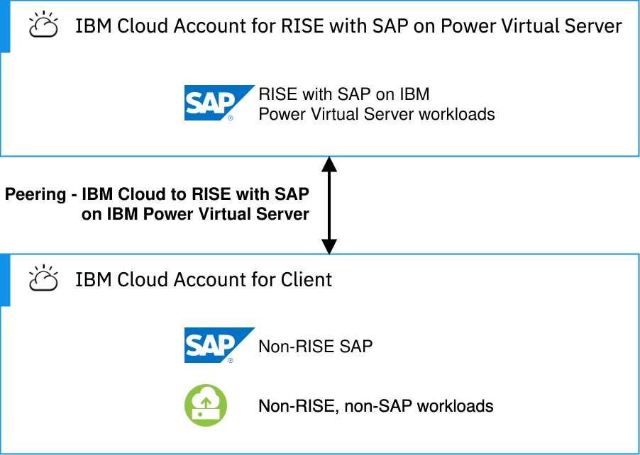
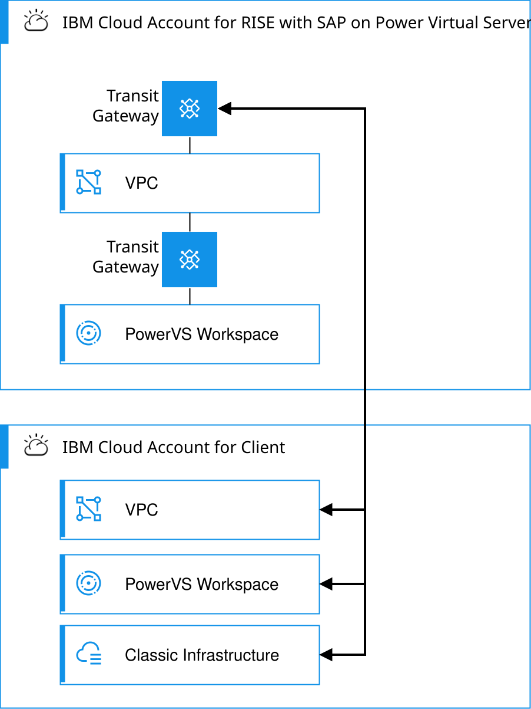

---

copyright:
  years: 2025
lastupdated: "2026-03-10"

keywords: SAP, RISE, PowerVS, RISE with SAP on PowerVS, SAP on IBM Cloud, Benefits of RISE with SAP on IBM Cloud, IBM Power Virtual Server, SAP modernization

subcollection: rise-with-sap-on-powervs

---

{{site.data.keyword.attribute-definition-list}}

# IBM Cloud
{: #integration-ibm-cloud}

In this setup, your RISE with SAP on {{site.data.keyword.powerSysFull}} workloads are running in the SAP® {{site.data.keyword.cloud_notm}} Account, and your {{site.data.keyword.cloud_notm}} surround workloads run in your own {{site.data.keyword.cloud_notm}} Account.
{: shortdesc}

{: caption="IBM Cloud Surround Workloads" caption-side="bottom"}

There are two types of connectivity patterns for peering your {{site.data.keyword.cloud_notm}} surround workloads to your RISE with SAP on {{site.data.keyword.powerSys_notm}} workloads:

* {{site.data.keyword.cloud_notm}} Transit Gateway.
* {{site.data.keyword.cloud_notm}} Site-to-Site VPN.

## The IBM Cloud Transit Gateway pattern
{: #integration-ibm-cloud-tgw}

With {{site.data.keyword.cloud_notm}} Transit Gateway, you can define and control communication between resources hosted in the {{site.data.keyword.cloud_notm}} infrastructure environments or on-premises networks. See [Getting started with IBM Cloud Transit Gateway](/docs/transit-gateway?topic=transit-gateway-getting-started).

With an {{site.data.keyword.cloud_notm}} Transit Gateway, you can connect:

* VPCs in your account or a different account.
* {{site.data.keyword.cloud_notm}} classic infrastructure in your account or a different account.
* Direct Link in your account or a different account.
* {{site.data.keyword.powerSys_notm}} in {{site.data.keyword.cloud_notm}} data center in your account or a different account.
* Unbound Generic Routing Encapsulation (GRE) tunnels allow a connection between a zone and an endpoint in IBM Cloud Classic in your account or a different account.
* Redundant Generic Routing Encapsulation (GRE) tunnels allow a connection between two zones and an endpoint in IBM Cloud Classic or a VPC in your account or a different account.

This pattern uses the {{site.data.keyword.cloud_notm}} Transit Gateway in the RISE with SAP on {{site.data.keyword.powerSys_notm}} {{site.data.keyword.cloud_notm}} Account. As this {{site.data.keyword.cloud_notm}} Transit Gateway has the local routing option, it only supports your VPC or {{site.data.keyword.powerSys_notm}} in the same region as the RISE with SAP on {{site.data.keyword.powerSys_notm}} VPC. Classic infrastructure is a flat global network. With this connection option, you can only connect one {{site.data.keyword.cloud_notm}} infrastructure as a service platform to the SAP RISE Transit Gateway.

{: caption="IBM Cloud Transit Gateway with IBM Cloud IaaS platforms" caption-side="bottom"}

If you have multiple VPCs or {{site.data.keyword.powerSys_notm}} instances that need a connection to the RISE with SAP on {{site.data.keyword.powerSys_notm}} environment, it is recommended to use the [Transit VPC pattern](/docs/pattern-transit-vpc?topic=pattern-transit-vpc-transit-vpc), where a VPC acts as a logical hub in your {{site.data.keyword.cloud_notm}} account. The following diagram depicts this connectivity pattern with the Transit VPC.

{: caption="IBM Cloud Transit Gateway with Transit VPC" caption-side="bottom"}

The process to request these connectivity options is as follows:

1. Request the service from SAP and supply:
   1. VPC: your VPC CRN
   2. Classic: Account ID
   3. {{site.data.keyword.powerSys_notm}}: {{site.data.keyword.powerSys_notm}} CRN
2. SAP adds a new connection to their existing gateway to your designated VPC, Classic or PowerVS environment.
3. You review and approve the connection request.

While the diagram shows the {{site.data.keyword.cloud_notm}} surround workload in a VPC, they can be hosted in the Classic or {{site.data.keyword.powerSys_notm}} infrastructure environments.
{: note}

## IBM Cloud Site-to-Site VPN pattern
{: #integration-ibm-cloud-vpn}

This pattern uses the {{site.data.keyword.cloud_notm}} VPN for VPC service to securely connect your VPC to the RISE with SAP on {{site.data.keyword.powerSys_notm}}. It can leverage a dynamic, route-based VPN with BGP routing to set up an IPsec site-to-site tunnel between your {{site.data.keyword.cloud_notm}} environment and RISE with SAP on {{site.data.keyword.powerSys_notm}} environment.

{: caption="IBM Cloud Site-to-Site VPN pattern" caption-side="bottom"}

The process to request these connectivity options is as follows:

1. Request the service from SAP.
2. SAP respond with their VPN endpoint details.
3. Create a site-to-site VPN and configure with the SAP provided details.
4. Provide SAP with your endpoint details.

See [About site-to-site VPN gateways](/docs/vpc?topic=vpc-using-vpn) and [Planning considerations for VPN gateways](/docs/vpc?topic=vpc-planning-considerations-vpn) for setting up your VPN connection in your IBM Cloud account.
