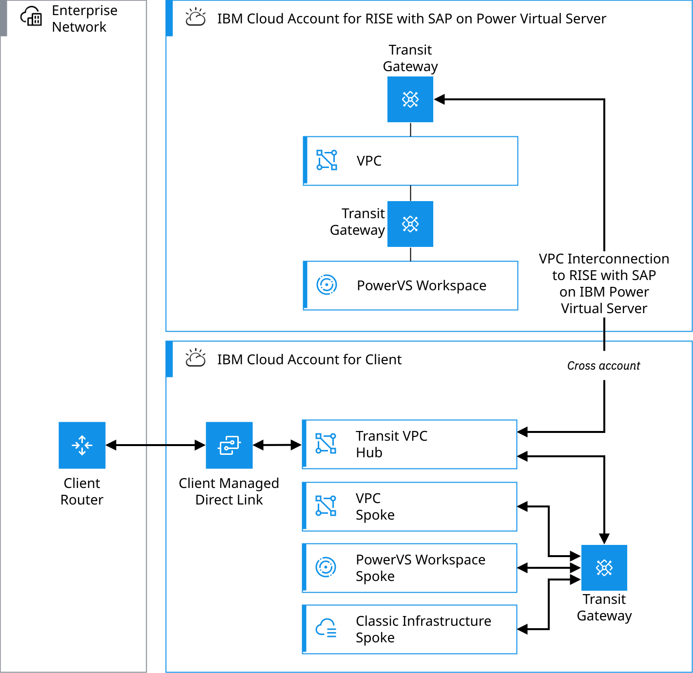
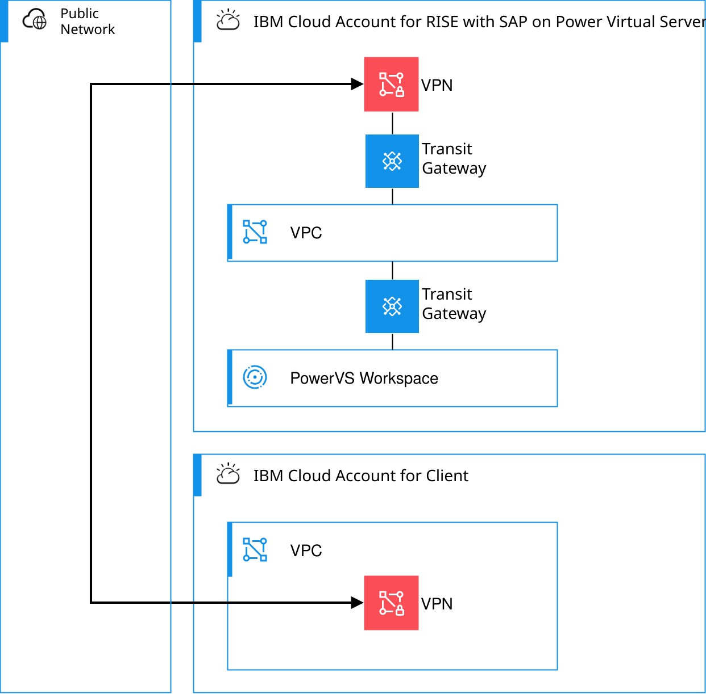

---

copyright:
  years: 2025
lastupdated: "2026-04-17"

keywords: SAP, RISE, PowerVS, RISE with SAP on PowerVS, SAP on IBM Cloud, Benefits of RISE with SAP on IBM Cloud, IBM Power Virtual Server, SAP modernization

subcollection: rise-with-sap-on-powervs

---

{{site.data.keyword.attribute-definition-list}}

# Connecting from {{site.data.keyword.cloud}}
{: #integration-ibm-cloud}

This use case illustrates a setup, where your RISE with SAP on {{site.data.keyword.powerSysFull}} workloads are running in the SAP® {{site.data.keyword.cloud_notm}} account, and your {{site.data.keyword.cloud_notm}} surround workloads run in your own {{site.data.keyword.cloud_notm}} account. This is a typical scenario for hybrid cloud designs.
{: shortdesc}

There are two types of connectivity patterns for peering your {{site.data.keyword.cloud_notm}} surround workloads to your RISE with SAP on {{site.data.keyword.powerSys_notm}} workloads:

* {{site.data.keyword.cloud_notm}} Transit Gateway
* {{site.data.keyword.cloud_notm}} Site-to-Site VPN

## The {{site.data.keyword.cloud}} Transit Gateway pattern
{: #integration-ibm-cloud-tgw}

With {{site.data.keyword.cloud_notm}} Transit Gateway, you can define and control communication between resources hosted in the {{site.data.keyword.cloud_notm}} infrastructure environments or on-premises networks. See [Getting started with {{site.data.keyword.cloud}} Transit Gateway](/docs/transit-gateway?topic=transit-gateway-getting-started).

This pattern uses the {{site.data.keyword.cloud_notm}} Transit Gateway in the RISE with SAP on {{site.data.keyword.powerSys_notm}} {{site.data.keyword.cloud_notm}} account. The pattern only supports your VPC in the same region as the RISE with SAP on {{site.data.keyword.powerSys_notm}}. In this pattern, you will provision the private connectivity (e.g. Direct Link) to on-premises though youw own IBM Cloud account.  

{: caption="{{site.data.keyword.cloud}} Transit Gateway with Transit VPC" caption-side="bottom"}

The process to request these connectivity options is as follows:

1. Request the service from SAP and supply:
   1. VPC: your VPC CRN
   2. Classic: Account ID
   3. {{site.data.keyword.powerSys_notm}}: {{site.data.keyword.powerSys_notm}} CRN
2. SAP adds a new connection to their existing gateway to your designated VPC, Classic or PowerVS environment.
3. You review and approve the connection request.

## {{site.data.keyword.cloud}} Site-to-Site VPN pattern
{: #integration-ibm-cloud-vpn}

This pattern uses the {{site.data.keyword.cloud_notm}} VPN for VPC service to securely connect your VPC to the RISE with SAP on {{site.data.keyword.powerSys_notm}}. It can leverage a dynamic, route-based VPN with BGP routing to set up an IPsec site-to-site tunnel between your {{site.data.keyword.cloud_notm}} environment and RISE with SAP on {{site.data.keyword.powerSys_notm}} environment.

{: caption="{{site.data.keyword.cloud}} Site-to-Site VPN pattern" caption-side="bottom"}

The process to request these connectivity options is as follows:

1. Request the service from SAP.
2. SAP respond with their VPN endpoint details.
3. Create a site-to-site VPN and configure with the SAP provided details.
4. Provide SAP with your endpoint details.

See [About site-to-site VPN gateways](/docs/vpc?topic=vpc-using-vpn) and [Planning considerations for VPN gateways](/docs/vpc?topic=vpc-planning-considerations-vpn) for setting up your VPN connection in your {{site.data.keyword.cloud}} account.
