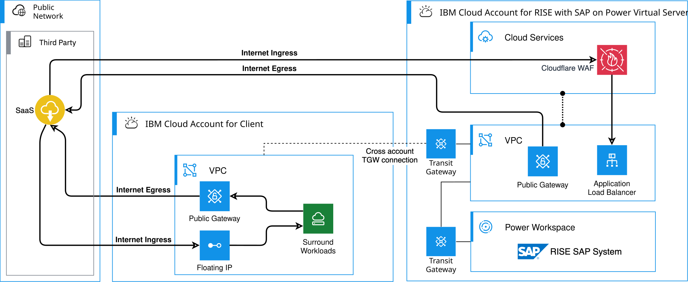
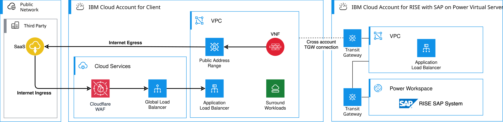

---

copyright:
  years: 2025
lastupdated: "2026-03-10"

keywords: SAP, RISE, PowerVS, RISE with SAP on PowerVS, SAP on IBM Cloud, Benefits of RISE with SAP on IBM Cloud, IBM Power Virtual Server, SAP modernization

subcollection: rise-with-sap-on-powervs

---

{{site.data.keyword.attribute-definition-list}}

# Internet access
{: #integration-internet}

This document describes access to and from the Internet for your RISE with SAP {{site.data.keyword.powerSysFull}}.
{: shortdesc}

## Outbound Internet
{: #integration-internet-outbound}

Your RISE with SAP {{site.data.keyword.powerSys_notm}} systems may require network egress to the Internet to integrate with external systems such as those provided by SaaS providers. You need to work with your SAP® representative to explore your needs for these communication paths. Network communication to the Internet is by default not enabled and default networking uses private IP ranges only. Internet connectivity requires planning with SAP, to optimally protect your SAP landscape.

## Inbound Internet
{: #integration-internet-inbound}

Your RISE with SAP {{site.data.keyword.powerSys_notm}} systems may require network ingress from the Internet to enable external systems such as those provided by third party providers to integrate with your SAP landscape. You need to work with your SAP representative to explore your needs for these communication paths. Network communication from the Internet is by default not enabled and default networking uses private IP ranges only. Internet connectivity requires planning with SAP, to optimally protect your SAP landscape.

When enabled, Internet ingress traffic the network communication is protected through various {{site.data.keyword.cloud_notm}} technologies such as network security groups, network access control lists, Web Application Firewall (WAF), proxy servers and others depending on use and network protocols. These services are entirely managed by SAP within the RISE with SAP {{site.data.keyword.powerSys_notm}} service. The network path between your SAP {{site.data.keyword.powerSys_notm}} systems and the Internet doesn't transit through a Customer {{site.data.keyword.cloud_notm}} Account if peered with the RISE with SAP {{site.data.keyword.powerSys_notm}} {{site.data.keyword.cloud_notm}} Account.

## Split internet access
{: #integration-internet-split}

The split internet access is the simplest and relies on the native services in each of the two {{site.data.keyword.cloud_notm}} accounts.

{: caption="Split internet access" caption-side="bottom"}

The diagram shows:

* Internet egress from RISE with SAP {{site.data.keyword.powerSys_notm}} to an external SaaS provider and not transiting your {{site.data.keyword.cloud_notm}} Account.
* Internet ingress to RISE with SAP {{site.data.keyword.powerSys_notm}} from an external 3rd party provider and not transiting your {{site.data.keyword.cloud_notm}} Account.
* Internet egress from your own surround workload hosted in your {{site.data.keyword.cloud_notm}} account access the Internet directly and not transiting the RISE with SAP {{site.data.keyword.powerSys_notm}} {{site.data.keyword.cloud_notm}} Account.
* Internet ingress to your own surround workload hosted in your {{site.data.keyword.cloud_notm}} account directly and not transiting the RISE with SAP {{site.data.keyword.powerSys_notm}} {{site.data.keyword.cloud_notm}} Account. You should consider using {{site.data.keyword.cloud_notm}} Internet Services, powered by Cloudflare, which provides a fast, highly performant, reliable, and secure internet service for customers running their business on {{site.data.keyword.cloud_notm}}. See [Getting started with IBM Cloud Internet Services](/docs/cis?topic=cis-getting-started)

When connecting to RISE with SAP discuss with your SAP representative on the transit gateway connection they provide to enable peering between your {{site.data.keyword.cloud_notm}} Account and the RISE with SAP {{site.data.keyword.cloud_notm}} Account.
{: note}

## Single internet access point
{: #integration-internet-single}

If a single point of access to and from the Internet is required for both the RISE with SAP and the surround workloads is required, consider the following pattern.

{: caption="Single internet access point" caption-side="bottom"}

The diagram shows:

* Optional {{site.data.keyword.cloud_notm}} Internet Services to protect Internet ingress traffic to your surround workloads and the RISE with SAP systems.
* A Virtual Network Firewall (VNF) to act as the next hop route to the Internet and configured in the VPC ingress routing tables that will get advertised to the transit gateway as well as the egress routing tables for your surround workloads.
* Ingress traffic to your surround workloads is via the public application load balancer in your {{site.data.keyword.cloud_notm}} Account.
* Ingress traffic to the RISE with SAP workloads is via the public application load balancer in your {{site.data.keyword.cloud_notm}} Account. A backend pool need to be configured with the IP addresses of the application load balancers in the RISE with SAP {{site.data.keyword.cloud_notm}} Account.

When connecting to RISE with SAP discuss with your SAP representative on the transit gateway connection they provide to enable peering between your {{site.data.keyword.cloud_notm}} Account and the RISE with SAP {{site.data.keyword.cloud_notm}} Account.
{: note}
