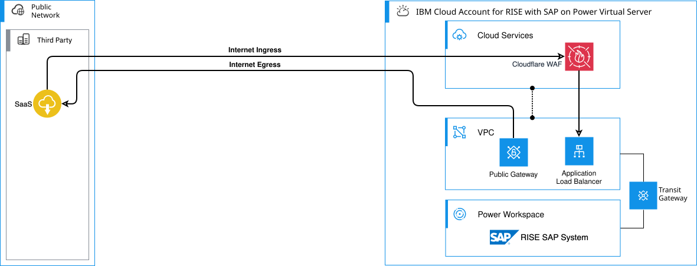

---

copyright:
  years: 2025
lastupdated: "2026-04-17"

keywords: SAP, RISE, PowerVS, RISE with SAP on PowerVS, SAP on IBM Cloud, Benefits of RISE with SAP on IBM Cloud, IBM Power Virtual Server, SAP modernization

subcollection: rise-with-sap-on-powervs

---

{{site.data.keyword.attribute-definition-list}}

# Connecting through the Internet
{: #integration-internet}

This use case describes the application access through the Internet for your RISE with SAP {{site.data.keyword.powerSysFull}}. Internet connectivity requires planning with SAP to optimally protect your SAP landscape.
{: shortdesc}

## Outbound Internet
{: #integration-internet-outbound}

Your RISE with SAP {{site.data.keyword.powerSys_notm}} systems may require network egress to the Internet to integrate with external systems such as those provided by SaaS providers. You need to work with your SAP® representative to explore your needs for these communication paths. Network communication to the Internet is by default not enabled.

## Inbound Internet
{: #integration-internet-inbound}

Your RISE with SAP {{site.data.keyword.powerSys_notm}} systems may require network ingress from the Internet to enable external systems such as those provided by third party providers to integrate with your SAP landscape. You need to work with your SAP representative to explore your needs for these communication paths. Network communication from the Internet is by default not enabled. 

Internet ingress traffic the network communication is protected through various {{site.data.keyword.cloud_notm}} technologies such as network security groups, network access control lists, Web Application Firewall (WAF), proxy servers and others depending on use and network protocols. These services are entirely managed by SAP within the RISE with SAP {{site.data.keyword.powerSys_notm}} service. The network path between your SAP {{site.data.keyword.powerSys_notm}} systems and the Internet doesn't transit through a Customer {{site.data.keyword.cloud_notm}} account if peered with the RISE with SAP {{site.data.keyword.powerSys_notm}} {{site.data.keyword.cloud_notm}} account.

## Deployment option - standalone RISE with SAP instance
{: #integration-internet-split}

If the RISE with SAP {{site.data.keyword.powerSys_notm}} is a standalone deployment, with no other assets or surround workloads in {{site.data.keyword.cloud_notm}}, then the Internet optional access is provided though the {{site.data.keyword.cloud_notm}} account of the RISE with SAP {{site.data.keyword.powerSys_notm}}.

{: caption="Standalone internet access" caption-side="bottom"}

The diagram shows:

* Internet egress from RISE with SAP {{site.data.keyword.powerSys_notm}} to an external SaaS provider.
* Internet ingress to RISE with SAP {{site.data.keyword.powerSys_notm}} from an external 3rd party provider.

## Deployment option - split internet access
{: #integration-internet-split}

If you have surround workloads in {{site.data.keyword.cloud_notm}}, and the connection between these has been arranged with peering, the split internet access is the simplest and relies on the native services in each of the two {{site.data.keyword.cloud_notm}} accounts. If you would provide the Internet access through on-premises, the same principles for the RISE with SAP {{site.data.keyword.powerSys_notm}} setup applies.

{: caption="Split internet access" caption-side="bottom"}

The diagram shows:

* Internet egress from RISE with SAP {{site.data.keyword.powerSys_notm}} to an external SaaS provider through SAP's {{site.data.keyword.cloud_notm}} account.
* Internet ingress to RISE with SAP {{site.data.keyword.powerSys_notm}} from an external 3rd party provider through SAP's {{site.data.keyword.cloud_notm}} account.
* Internet egress from your own surround workload hosted in your {{site.data.keyword.cloud_notm}} account access the Internet directly and not transiting the RISE with SAP {{site.data.keyword.powerSys_notm}} {{site.data.keyword.cloud_notm}} account.
* Internet ingress to your own surround workload hosted in your {{site.data.keyword.cloud_notm}} account directly and not transiting the RISE with SAP {{site.data.keyword.powerSys_notm}} {{site.data.keyword.cloud_notm}} account.
  
You should consider using {{site.data.keyword.cloud_notm}} Internet Services, powered by Cloudflare, which provides a fast, highly performant, reliable, and secure internet service for customers running their business on {{site.data.keyword.cloud_notm}}. See [Getting started with {{site.data.keyword.cloud}} Internet Services](/docs/cis?topic=cis-getting-started).

When connecting to RISE with SAP discuss with your SAP representative on the transit gateway connection they provide to enable peering between your {{site.data.keyword.cloud_notm}} account and the RISE with SAP {{site.data.keyword.cloud_notm}} account.
{: note}
