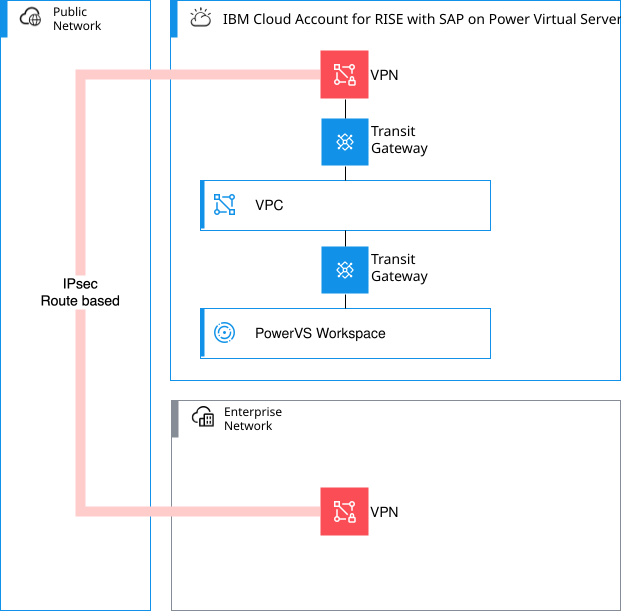
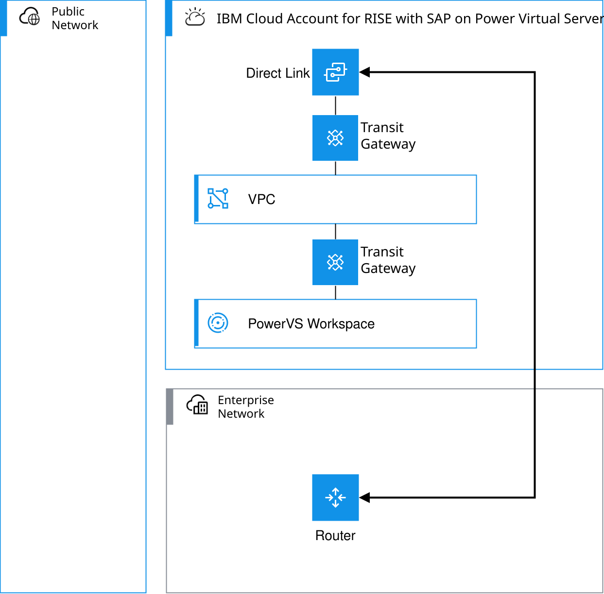

---

copyright:
  years: 2025
lastupdated: "2026-03-10"

keywords: SAP, RISE, PowerVS, RISE with SAP on PowerVS, SAP on IBM Cloud, Benefits of RISE with SAP on IBM Cloud, IBM Power Virtual Server, SAP modernization

subcollection: rise-with-sap-on-powervs

---

{{site.data.keyword.attribute-definition-list}}

# Connecting from on-premises
{: #integration-on-premises}

This on-premises use case illustrates a want to connect on-premises or other external locations to the RISE with SAP on {{site.data.keyword.powerSysFull}}. This use case is useful if a client is new and they don't have an existing IBM Cloud presence.

The connectivity between the Enterprise Network and the IBM Cloud Account for Client can be optionally **VPN**, **Direct Link** or **both** depending on client requirements.

## Connecting using VPN
{: #integration-on-premises-vpn}

Enable access from your Enterprise Network to your IBM Cloud account with an IBM Cloud VPN for VPC site-to-site gateway. Traffic between IBM Cloud and your Enterprise Network is encrypted via Internet Protocol security (IPsec) and transferred through a secure tunnel over the internet. This option is efficient, and faster to implement when compared to the {{site.data.keyword.dl_short}}. An overview of the VPN connectivity pattern is shown in the diagram below.

{: caption="Integrating on-premises and IBM Cloud with RISE with SAP on IBM Power Virtual Server using VPN" caption-side="bottom"}

IBM Cloud VPN for VPC provides a simple, yet powerful solution for highly scalable and robust site-to-site VPN gateways. With this service, you can create site-to-site VPN tunnels for secure, encrypted connectivity. Connect from on-premises sites to IBM Cloud through a VPN gateway on an IBM Cloud VPC, and a peer gateway on-premises.

The process to request these connectivity options is as follows:

1. Request the service from SAP.
2. SAP respond with their VPN endpoint details.
3. Configure your site-to-site VPN gateway with the SAP provided details.
4. Provide SAP with your endpoint details.

This service provides a mixture of industry-standard security and encryption options as well as support for Pre-Shared Key (PSK) authentication. This service also provides the ability to quickly add and remove VPN connections with the option to use pre-defined configurations. See [About site-to-site VPN gateways](/docs/vpc?topic=vpc-using-vpn).

## Connecting using Direct Link
{: #integration-on-premises-direct-link}

Use the {{site.data.keyword.dl_short}} if you require a higher throughput or more consistent network experience than an internet-based connection. {{site.data.keyword.dl_short}} connects your on-premises resources to your cloud resources and offers more consistent, higher-throughput connectivity, keeping traffic within the IBM Cloud network. An overview of the Direct Link connectivity pattern is shown in the diagram below.

{: caption="Integrating on-premises and IBM Cloud with RISE with SAP on IBM Power Virtual Server using Direct Link" caption-side="bottom"}

Currently, two types of {{site.data.keyword.dl_short}} connection options are available:

* **Direct Link Dedicated** - Terminate a single-tenant, fiber-based, cross-connect into your own IBM Cloud Private network connection. The speeds that are supported for the Direct Link Dedicated offering are 1 Gbps, 2 Gbps, 5 Gbps, and 10 Gbps.
* **Direct Link Connect** - Use a service provider to quickly establish and deliver connectivity to IBM Cloud. These service providers are already connected to the IBM Cloud network and use a multi-tenant, high capacity links, known as network-to-network interfaces (NNI). Available speeds are based on your provider and provider's location. Partners include: AT&T, Cologix, Console Connect, DE-CIX, Digital Realty, Equinix, Megaport, and Verizon SCI.

The process to request these connectivity options is as follows:

1. Request the service from SAP providing the details for the Direct Link.
2. SAP respond with their Direct Link details.
3. Configure your side of the Direct Link with the SAP provided details.

For more information about IBM Cloud Direct Links, see [Getting started with IBM Cloud Direct Link](/docs/dl?topic=dl-get-started-with-ibm-cloud-dl).
