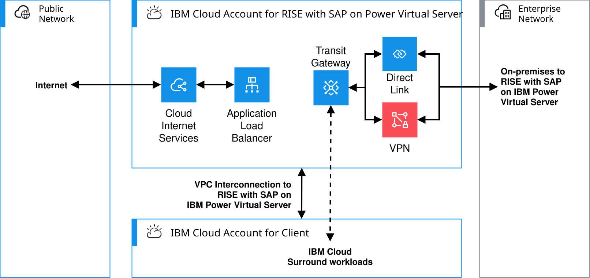

---

copyright:
  years: 2025
lastupdated: "2026-03-10"

keywords: SAP, RISE, PowerVS, RISE with SAP on PowerVS, SAP on IBM Cloud, Benefits of RISE with SAP on IBM Cloud, IBM Power Virtual Server, SAP modernization

subcollection: rise-with-sap-on-powervs

---

{{site.data.keyword.attribute-definition-list}}

# Overview
{: #integration-overview}

With RISE with SAP on {{site.data.keyword.powerSysFull}}, the SAP&reg; Enterprise Cloud Services (ECS) team manages the SAP systems, however, it is your responsibility to establish network connectivity and domain name server (DNS) resolution to RISE with SAP on Power Virtual Server. IBM recommends that you consult with your SAP representative to understand the available options on how to connect your on-premises networks and your IBM Cloud Account networks to the RISE with SAP on Power Virtual Server networks.
{: shortdesc}

This document explains the concepts and best practices to follow for a performant and secure solution to connect your networks with the RISE with SAP on IBM Power Virtual Server networks.

In this document the term **surround workloads** is used to define a workload that integrates with your SAP system hosted in RISE with SAP on Power Virtual Server. These surround workloads can be non-RISE SAP or non-RISE non-SAP workloads. These surround workloads can be hosted:

* Internet - These are typically SaaS based services, such as SAP Business Technology Platform (BTP) to which connections can be established only through Internet.
* On-premises - These surround workloads are typically loosely coupled workloads that do not require high bandwidth or low latency connections.
* IBM Cloud - These surround workloads are located in IBM Cloud, they can be hosted in one of the three IBM Cloud infrastructure environments; IBM Cloud Classic, IBM Cloud VPC or IBM Power Virtual Server in IBM data center.
* On another cloud - These surround workloads are located and hosted in other clouds and accessed through private networks.

While your RISE with SAP on IBM Power Virtual Server workloads are running in the SAP IBM Cloud Account, your IBM Cloud surround workloads run in your own IBM Cloud Account. And connectivity must be established between these two.
{: note}

## IP address schema
{: #integration-ip}

When you request the RISE with SAP on IBM Power Virtual Server service, you supply to SAP an IP address schema that will be used within the SAP managed IBM Cloud Enterprise Account. This IP address schema must not overlap with any IP addresses used elsewhere in your organization’s network or any peered resource from your IBM Cloud accounts, client managed or client’s service provider managed, or other interconnected cloud resource.

## RISE with SAP on IBM Power Virtual Server inter-connectivity
{: #integration-overview-arch-connectivity}

The diagram below shows the inter-connectivity options provided by RISE with SAP on IBM Power Virtual Server.

{: caption="Inter-connectivity" caption-side="bottom"}

The connections to RISE with SAP on IBM Power Virtual Server are defined as follows:

* **Internet to RISE with SAP on IBM Power Virtual Server** - This connectivity provides application access to and from the Internet. The Internet connection allows the use SAP Cloud Connector, for example.
* **On-premises to RISE with SAP on IBM Power Virtual Server** - This connection connects your user/workloads on-premises or other non-IBM Cloud locations to the RISE with SAP on IBM Power Virtual Server service. This connectivity is defined by you and SAP, and can be one of the following types:
    * Site-to-site IPsec VPN
    * Direct Link
* **Peering - IBM Cloud to RISE with SAP on IBM Power Virtual Server** - This connectivity provides access between resources in your IBM Cloud account and your resources in RISE with SAP on IBM Power Virtual Server. There is also a variant of this connectivity type where your IBM Cloud account is a hub that connects to your on-premises or external locations and your IBM Cloud resources, including your surround workloads, to RISE with SAP on IBM Power Virtual Server.
* **Multi-cloud with RISE with SAP on IBM Power Virtual Server** - This connectivity option allows you to connect to other cloud providers, such as AWS or Azure. From the technical perspective, this option is similar to the peering or on-premises connectivity options, but the use case is slightly different.

These documents define the above mentioned network integration patterns:

* [Connecting to and from from the Internet](/docs/rise-with-sap-on-powervs?topic=rise-with-sap-on-powervs-integration-internet) - Integrating RISE with SAP on IBM Power Virtual Server with your workloads through the Internet. 
* [Connecting from on-premises](/docs/rise-with-sap-on-powervs?topic=rise-with-sap-on-powervs-integration-on-premises) - Integrating RISE with SAP on IBM Power Virtual Server with your non-RISE SAP and non-RISE non-SAP on-premises workloads.
* [Connecting from IBM Cloud](/docs/rise-with-sap-on-powervs?topic=rise-with-sap-on-powervs-integration-ibm-cloud) - Integrating RISE with SAP on IBM Power Virtual Server with your non-RISE SAP and non-RISE non-SAP workloads in IBM Cloud.
* [Connecting with multi-cloud environments](/docs/rise-with-sap-on-powervs?topic=rise-with-sap-on-powervs-integration-multi-cloud) - Integrating RISE with SAP on IBM Power Virtual Server with your non-RISE SAP and non-RISE non-SAP workloads hosted with other cloud providers.

# DNS Considerations
{: #integration-dns}

When you request the RISE with SAP on {{site.data.keyword.powerSysFull}}, you supply your domain name for example `<customer>.com`. SAP&reg; create a sub-domain for example `sap.<customer>.com` on the DNS servers in their {{site.data.keyword.cloud}} Enterprise Account that hosts the fully qualified domain names and IP addresses for the services they host for you. SAP allow a zone transfer from their SAP DNS servers to your DNS servers, so that name resolution on your network can occur.

In some circumstances SAP will allow DNS forwarding of requests from your DNS servers to SAP's DNS servers. You must request this non-preferred method from your SAP representative.

The selected inter-connectivity option will influence how the connectivity between your DNS servers and RISE with SAP DNS servers must be setup. For more details, refer to each connectivity option's network integration patterns.  

