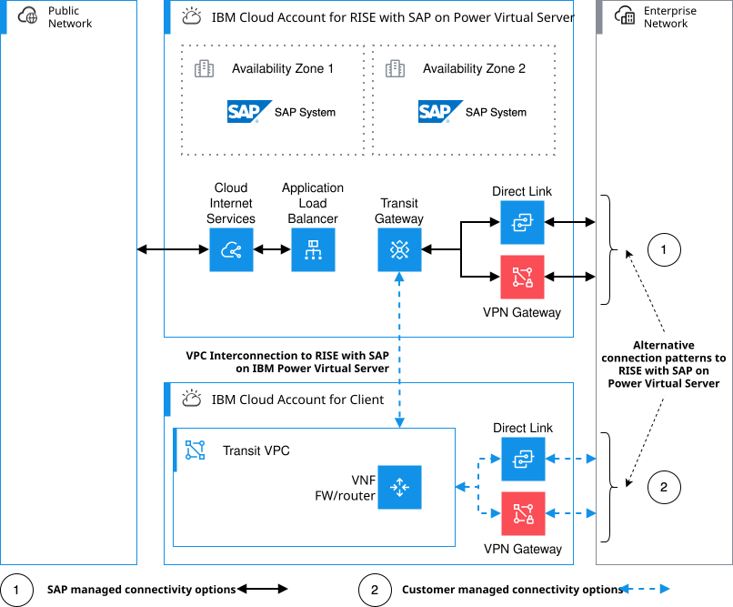

---

copyright:
  years: 2025
lastupdated: "2026-06-08"

keywords: SAP, RISE, PowerVS, RISE with SAP on PowerVS, {{site.data.keyword.ibm_cloud_sap}}, Architecture diagram of RISE with SAP on IBM Power Virtual Server, IBM {{site.data.keyword.powerSys_notm}}, SAP modernization

subcollection: rise-with-sap-on-powervs

---

{{site.data.keyword.attribute-definition-list}}

# Reference architecture
{: #reference-architecture}

## Overview
{: #reference-architecture-overview}

Using {{site.data.keyword.powerSysFull}}, the cloud-based version of the mission-critical IBM Power server platform used for on-premises enterprise resource planning (ERP), you can rapidly transform on-premises SAP ERP systems, modernize business processes and become more agile. Known for its high security, scalability and reliability, IBM Power servers are engineered for fewer disruptions and facilitates faster migration, supported by the highly resilient and secured {{site.data.keyword.cloud_notm}} platform.
{: shortdesc}

SAP Cloud ERP Private is the software in the RISE with SAP on IBM {{site.data.keyword.powerSys_notm}} service that holds the client’s mission critical data and business processes. SAP provides a managed private environment with multi-layer defense in depth architecture handling infrastructure and technical managed services in line with their service level agreement (SLA).

{: caption="RISE with SAP on IBM {{site.data.keyword.powerSys_notm}} Overview" caption-side="bottom"}

SAP Cloud ERP Private Edition is a single-tenant managed private environment for clients where SAP creates a separate {{site.data.keyword.cloud_notm}} Account in their {{site.data.keyword.cloud_notm}} Enterprise Account for each customer. The application and database virtual server instances are solely dedicated to a single client.

SAP creates and manages the entire RISE with SAP on IBM {{site.data.keyword.powerSys_notm}} architecture running in an {{site.data.keyword.cloud_notm}} Enterprise Account owned by SAP. Clients of RISE with SAP on IBM {{site.data.keyword.powerSys_notm}} do not get access to the SAP {{site.data.keyword.cloud_notm}} Enterprise Account. All technical resources deployed in this {{site.data.keyword.cloud_notm}} Enterprise Account are defined, validated, deployed and managed by SAP.

When connecting to the RISE with SAP on IBM {{site.data.keyword.powerSys_notm}} deployment, you must select between these connectivity patterns: 

1. If you only use RISE with SAP on IBM {{site.data.keyword.powerSys_notm}}, then you can connect directly from your on-premises location to the RISE with SAP on IBM {{site.data.keyword.powerSys_notm}} using the private connectivity options what SAP provides (such as Direct Link or site-to-site VPN).
2. If you have a hybrid solution where you have surround workloads running in your own {{site.data.keyword.cloud_notm}} account, then you must use the VPC interconnection option. In this option, SAP provides a cross-account connection to a SAP managed Transit Gateway and you are responsible for building the private connectivity (such as Direct Link or site-to-site VPN) from your own {{site.data.keyword.cloud_notm}} account.
3. Internet access is provided by default through the RISE with SAP on IBM {{site.data.keyword.powerSys_notm}}. Discuss with your SAP representative to discuss alternate design patterns for this.  

For more information on connectivity patterns, see [connectivity options for RISE with SAP on {{site.data.keyword.powerSysFull}}](/docs/rise-with-sap-on-powervs?topic=rise-with-sap-on-powervs-integration-overview).
