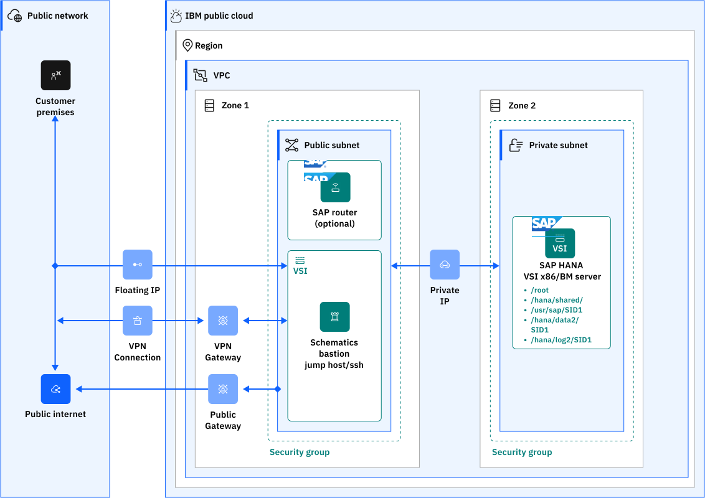
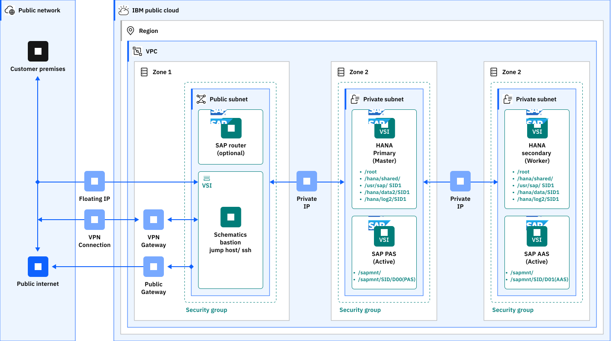
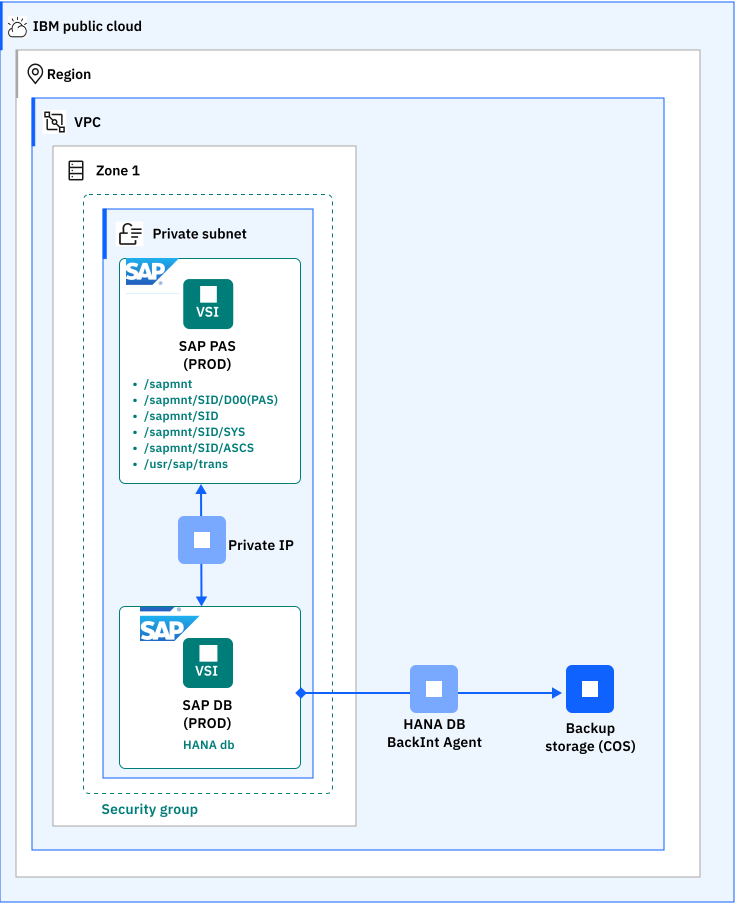

---

copyright:
  years: 2025
lastupdated: 2025-02-08

keywords: SAP, {{site.data.keyword.cloud_notm}} SAP-Certified Infrastructure, {{site.data.keyword.ibm_cloud_sap}}, SAP Workloads

subcollection: rise-with-sap-on-powervs

---

{{site.data.keyword.attribute-definition-list}}

# Non-RISE SAP surround workloads
{: #non-rise-sap-surround-workloads}

Non-RISE SAP® surround workloads are those workloads that currently reside alongside your on-premise SAP systems hosted on {{site.data.keywordIBM&reg}} Power that you intend to migrate to RISE with SAP on {{site.data.keyword.powerSysFull}}. These non-rise SAP surround workloads cannot be hosted in the SAP owned RISE with SAP on IBM Power Virtual Server IBM Account, however, they can be migrated to your IBM Cloud account and peered with the SAP owned RISE with SAP on IBM Power Virtual Server IBM Account.

The solution guide [SAP](/docs/sap) is a detailed collection of documents for IBM Cloud for SAP and covers the following:

1. [SAP Solutions and IBM Cloud Intel Bare Metal Servers on Classic Infrastructure](/docs/sap?topic=sap-fast-path-site-map-intel-bm)
2. [SAP Solutions and IBM Cloud Intel Bare Metal Servers on VPC Infrastructure](/docs/sap?topic=sap-fast-path-site-map-intel-bm-vpc)
3. [SAP Solutions and IBM Cloud Intel Virtual Servers on VPC Infrastructure](/docs/sap?topic=sap-fast-path-site-map-intel-vs-gen2)
4. [SAP Solutions and IBM Cloud for VMware on Classic Infrastructure](/docs/sap?topic=sap-fast-path-site-map-vmware-sddc)
5. [SAP Solutions on IBM Power Virtual Server](/docs/sap?topic=sap-fast-path-site-map-power-vs)

For details on supported SAP technical and business applications see:

* [Supported SAP Technical Applications](/docs/sap?topic=sap-overview-sap-offerings-overview#supported-sap-technical-applications-summary)
* [Supported SAP Business Applications](/docs/sap?topic=sap-overview-sap-offerings-overview#supported-sap-business-applications-summary)

These documents, above, provide a detailed and comprehensive view to enable your assessment, build, migration and operation of your non-rise SAP surround workloads to IBM Cloud.

## Reference architectures
{: #non-rise-sap-surround-workloads-ra}

In addition to the [SAP](/docs/sap) solution guide, there are three detailed solution guides that include reference architectures. These documents do not cover SAP configuration and SAP component deployment scenarios, they focus on IBM cloud infrastructure options to support SAP workloads.

* [Overview of SAP on VPC](/docs/pattern-sap-on-vpc?topic=pattern-sap-on-vpc-overview) - This pattern can be used as a guide to meet typical customer requirements and provide a base reference solution for a secure and resilient SAP NetWeaver and HANA or SAP NetWeaver and AnyDB deployment to IBM Cloud VPC.
* [SAP on Power Virtual Server](/docs/pattern-sap-on-powervs) -  This pattern illustrates a Single-Zone, Multi-Region design deployed to IBM Power Virtual Server, which can provide both DR and HA to provide 99.95 availability for an SAP NetWeaver/HANA or SAP NetWeaver/AnyDB solution to meet typical customer requirements.
* [Solution design for the deployment of SAP to VMware Cloud Foundation (VCF) for Classic on IBM Cloud](/docs/pattern-sap-on-vcenter-server) - This pattern can be used as a guide to meet typical customer requirements and provide a base reference solution for a secure and resilient SAP NetWeaver and SAP HANA or SAP NetWeaver and SAP AnyDB deployment to VMware Cloud Foundation (VCF) for Classic on IBM Cloud. Broadcom provides guidelines for SAP HANA, see [Architecture guidelines and best practices for deployments of SAP HANA on VMware vSphere architecture and technical considerations guide](https://www.vmware.com/docs/sap_hana_on_vmware_vsphere_best_practices_guide-white-paper)

## Deployable Architectures
{: #non-rise-sap-surround-workloads-da}

Deployable architectures are Infrastructure as Code (IaC) artifacts that enable an automated build of a reference architecture. This approach enables enterprises to easily and quickly deploy the SAP accredited infrastructure that hosts your SAP technical and business applications. The following deployable architectures are available:

* [Power Virtual Server with VPC Landing Zone](/docs/powervs-vpc) - The Power Virtual Server with VPC Landing Zone deployable architectures are a set of IaC assets based on the IBM Cloud for Financial Services reference architecture. You can use the deployable architectures to create a secure and customizable IBM Cloud® Power Virtual Server Infrastructure (PowerVS) offering according to the best practices and requirements from the IBM Cloud. This document provides the following four deployable architecture variants:

    1. [Power Virtual Server with VPC landing zone - 'Standard Variation'](/docs/deployable-reference-architectures?topic=deployable-reference-architectures-deploy-arch-ibm-pvs-inf-standard) - The Standard deployment of the Power Virtual Server with VPC landing zone creates VPC services and a Power Virtual Server workspace and interconnects them. A proxy service for public internet access from the PowerVS workspace is configured. You can optionally configure some management components on VPC (such as an NFS service, NTP forwarder, and DNS forwarder). A diagram is shown below:
    
    {: caption="Enterprise" caption-side="bottom"}

    2. [Power Virtual Server with VPC landing zone - 'Standard Extend Variation'](/docs/deployable-reference-architectures?topic=deployable-reference-architectures-deploy-arch-ibm-pvs-inf-extension) - The Power Virtual Server with VPC landing zone as variation 'Extend Power Virtual Server with VPC landing zone' creates an additional Power Virtual Server workspace and connects it with the already created Power Virtual Server with VPC landing zone. It builds on the existing Power Virtual Server with VPC landing zone deployed as a variation 'Create a new architecture'. A diagram is shown below:
    
    {: caption="Enterprise" caption-side="bottom"}

    3. [Power Virtual Server with VPC landing zone - 'Quickstart Variation'](/docs/deployable-reference-architectures?topic=deployable-reference-architectures-deploy-arch-ibm-pvs-inf-standard-plus-vsi) - Quickstart deployment of the Power Virtual Server with VPC landing zone creates VPC services, a Power Virtual Server workspace, and interconnects them. It also deploys a Power Virtual Server of chosen T-shirt size or custom configuration. Supported operating systems are AIZ, IBMi, and Linux images. A proxy service for public internet access from the PowerVS workspace is configured. You can optionally configure some management components on VPC (such as an NFS service, NTP forwarder, and DNS forwarder).A diagram is shown below:
    
    {: caption="Enterprise" caption-side="bottom"}

    4. [Power Virtual Server with VPC landing zone - as 'Import' deployment](/docs/deployable-reference-architectures?topic=deployable-reference-architectures-power-virtual-server-with-vpc-landing-zone-as-import-deployment) - This solution helps to install the deployable architecture 'Power Virtual Server for SAP HANA' on top of a pre-existing Power Virtual Server(PowerVS) landscape. 'Power Virtual Server for SAP HANA' automation requires a schematics workspace id for installation. The 'Import' solution creates a schematics workspace by taking pre-existing VPC and PowerVS infrastructure resource details as inputs. The ID of this schematics workspace will be the pre-requisite workspace id required by 'Power Virtual Server for SAP HANA' to create and configure the PowerVS instances for SAP on top of the existing infrastructure. A diagram is shown below:
    
    {: caption="Enterprise" caption-side="bottom"}

* [Power Virtual Server for SAP HANA](/docs/sap-powervs) - This deployable architecture is designed to assist you in deploying SAP ERP software landscapes into IBM Cloud on the IBM Power Virtual Server infrastructure. This is the second step in the deployment process for creating a full environment. Before starting this step, you should first deploy 'Power Virtual Server with VPC landing zone' deployable architecture. Once this is completed, you are prepared to start this step. This document has two deployable architecture variants:

    1. [Power Virtual Server for SAP HANA - variation 'SAP ready PowerVS'](/docs/deployable-reference-architectures?topic=deployable-reference-architectures-sap-ready-to-go) - The SAP-ready PowerVS variation of the Power Virtual Server for SAP HANA creates a basic and expandable SAP system landscape. The variation builds on the foundation of the VPC landing zone and Power Virtual Server with VPC landing zone. PowerVS instances for SAP HANA, SAP NetWeaver, and optionally for shared SAP files are deployed and preconfigured for SAP installation. Services such as DNS, NTP, and NFS running in VPC and provided by Power Virtual Server with VPC landing zone are leveraged. The transit gateway provide the network bridge between the IBM Power infrastructure and the IBM Cloud® VPC and public internet. The resulting SAP landscape leverages the services such as Activity Tracker, Cloud Object Storage, Key Management from the VPC landing zone and the network connectivity configuration provided by Power Virtual Server with VPC landing zone. A diagram is shown below:
    
    {: caption="Enterprise" caption-side="bottom"}

    2. [Power Virtual Server for SAP HANA - variation 'SAP S/4HANA or BW/4HANA'](/docs/deployable-reference-architectures?topic=deployable-reference-architectures-sap-s4hana-bw4hana) - 'SAP S/4HANA or BW/4HANA' variation of 'Power Virtual Server for SAP HANA' creates a basic and expandable SAP system landscape built on the foundation of 'Power Virtual Server with VPC landing zone'. PowerVS instances for SAP HANA, SAP NetWeaver, and optionally for shared SAP files are deployed and preconfigured for SAP installation. The S/4HANA or BW/4HANA solution is installed based on the selected version. Services such as DNS, NTP, and NFS running in VPC and provided by Power Virtual Server with VPC landing zone are leveraged. Transit gateway connections provide the network bridge between the IBM Power infrastructure and the IBM Cloud® VPC and public internet. The resulting SAP landscape leverages the services such as Activity Tracker, Cloud Object Storage, Key Management from the VPC landing zone and the network connectivity configuration provided by Power Virtual Server with VPC landing zone. A diagram is shown below:
    
    {: caption="Enterprise" caption-side="bottom"}

* [VPC for SAP HANA NetWeaver ABAP](https://cloud.ibm.com/catalog/architecture/deploy-arch-ibm-sap-vpc-automation-hana-nw-abap-c0fc9daf-791b-42d2-9fe3-406f267b89ac-global) - This automation solution is designed for the deployment of a SAP Netweaver application server VSI and a SAP HANA DB VSI in an existing VPC, using an existing bastion host with secure remote SSH access. It uses Terraform to deploy the VSIs and associated block storage and Ansible to customize the infrastructure and install SAP. The SAP solution will be deployed on top of one of the following VSI operating systems; SUSE Linux Enterprise Server 15 SP 3 for SAP, SUSE Linux Enterprise Server 15 SP 4 for SAP, Red Hat Enterprise Linux 8.4 for SAP, Red Hat Enterprise Linux 8.6 for SAP. This automation requires the following:

    * VPC, subnet, security group.
    * A deployment server, also known as a bastion server in the same VPC, with the SAP kits from the SAP Portal downloaded to it.

A diagram is shown below:
    
{: caption="Enterprise" caption-side="bottom"}

* [VPC with Additional Application Server ABAP on Linux for SAP HANA](https://cloud.ibm.com/catalog/architecture/deploy-arch-ibm-sap-vpc-automation-hana-nw-abap-aas-51f5ccbc-23fe-42d0-a17c-7a90b73da835-global) - This automation deploys a SAP Netweaver application server VSI in an existing VPC. The automation has been designed to add an additional SAP Netaweaver application server after the [VPC for SAP HANA NetWeaver ABAP](https://cloud.ibm.com/catalog/architecture/deploy-arch-ibm-sap-vpc-automation-hana-nw-abap-c0fc9daf-791b-42d2-9fe3-406f267b89ac-global) deplyabkle architectire has been used. A Terraform script is used for the deployment of the VSI, in an existing VPC, that contains a subnet and a security group. An Ansible script is used to install and configure the SAP Netweaver application server. This automation requires the following:

    * VPC, subnet, security group.
    * A deployment server, also known as a bastion server in the same VPC, with the SAP kits from the SAP Portal downloaded to it.

A diagram is shown below:
    
{: caption="Enterprise" caption-side="bottom"}

* [SAP HANA Backup using Backint and IBM Cloud Object Storage](https://cloud.ibm.com/catalog/architecture/deploy-arch-ibm-sap-vpc-automation-hana-backup-cos-a2a5c6fa-64e8-4907-a88d-f8d38214d218-global) - This automation solution is designed for the implementation of an SAP HANA Backup solution using Backint and IBM Cloud Object Storage. It is based on SAP note "2935898 - Install and Configure SAP HANA Backint Agent for Amazon S3". A diagram is shown below:
    
{: caption="Enterprise" caption-side="bottom"}

There is no deployable architecture for SAP to VMware Cloud Foundation (VCF) for Classic on IBM Cloud. Review and follow the steps detailed in [Solution design for the deployment of SAP to VMware Cloud Foundation (VCF) for Classic on IBM Cloud](/docs/pattern-sap-on-vcenter-server) which provides a base reference solution for a secure and resilient SAP NetWeaver and SAP HANA or SAP NetWeaver and SAP AnyDB deployment to VMware Cloud Foundation (VCF) for Classic on IBM Cloud.

## Other Reference Architectures
{: #non-rise-sap-surround-workloads-other-ra}

The following reference architecture are also available:

* [SAP HANA scale-out Reference Architecture](/docs/sap?topic=sap-refarch-hana-scaleout) - This reference architecture describes the Intel Bare Metal servers on Classic Infrastructure and Intel Virtual Servers in VPC Infrastructure (Gen2).
* [SAP NetWeaver 7.x on UNIX with Sybase on IBM Cloud VPC](/docs/sap?topic=sap-sap-refarch-nw-sybase) - This reference architecture describes SAP NetWeaver 7.x APAB stack, Java stack, and dual stack (ABAP+Java) architectural design on Virtual server instances on IBM Cloud VPC.
* [SAP NetWeaver 7.x on UNIX with Db2 on IBM Cloud VPC](/docs/sap?topic=sap-sap-refarch-nw-db2) - This reference architecture describes two deployments on Virtual server instances on IBM Cloud VPC using IBM Db2; standard and distributed.
* [SAP NetWeaver 7.x on Windows Servers with MS SQL on IBM Cloud VPC](/docs/sap?topic=sap-sap-refarch-nw-mssql) - This reference architecture describes two deployments on Virtual server instances on IBM Cloud VPC using Microsoft SQL; standard and distributed.
* [SAP NetWeaver 7.x with SAP HANA IBM Cloud VPC](/docs/sap?topic=sap-sap-refarch-nw-hana) - This reference architecture describes two deployments on Virtual server instances on IBM Cloud VPC using SAP HANA; single-host HANA system and multiple-host SAP HANA system.
