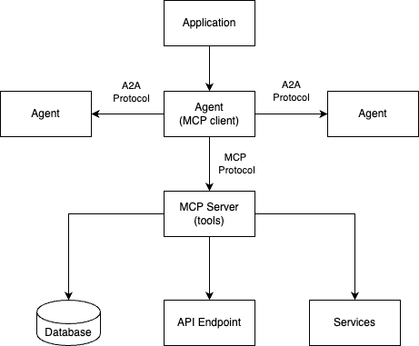
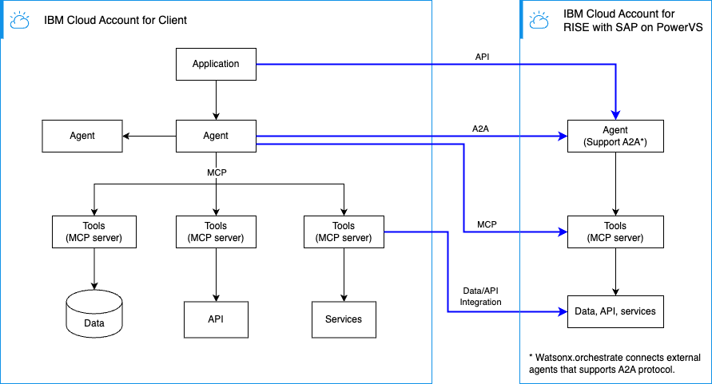

---

copyright:
  years: 2025
lastupdated: "2026-04-02"

keywords: SAP, RISE, PowerVS, RISE with SAP on PowerVS, SAP on IBM Cloud, Benefits of RISE with SAP on IBM Cloud, IBM Power Virtual Server, SAP modernization

subcollection: rise-with-sap-on-powervs

---

{{site.data.keyword.attribute-definition-list}}

# Agentic AI
{: #solution-agentic-ai}

## Introduction

This document provides a comprehensive guide to building Agentic AI solutions in IBM Cloud, with specific focus on integration with RISE with SAP. It covers architectural patterns, deployment options, and the IBM Cloud services required to support enterprise-grade agentic AI implementations.

Agentic AI represents a paradigm shift in artificial intelligence, where autonomous agents can reason, plan, and execute tasks using various tools and data sources. When integrated with SAP systems through RISE with SAP, these agents can automate complex business processes and provide intelligent assistance across the enterprise.


---

## Agentic AI Architecture Layers
{: #solution-agentic-ai-architecture-layers}

Agentic AI solutions are built on multiple interconnected layers, each serving a specific purpose in the overall architecture:



### 1. Data Layer
{: #solution-agentic-ai-architecture-layers-data}

**Location Flexibility:**
- **On-Premises**: Legacy systems, SAP ERP, databases
- **Cloud**: IBM Cloud Object Storage, Cloud Databases, watsonx.data
- **Multi-Cloud**: AWS S3, Azure Blob Storage, Google Cloud Storage
- **Hybrid**: Combination of on-premises and cloud data sources

**Key Characteristics:**
- Data can reside anywhere in the enterprise landscape
- Supports structured, semi-structured, and unstructured data
- Enables real-time and batch data access patterns
- Maintains data sovereignty and compliance requirements

### 2. Tools Layer
{: #solution-agentic-ai-architecture-layers-tool}

**Integration Capabilities:**
- **Data Integration**: Connect to databases, data lakes, and data warehouses
- **API Integration**: REST APIs, GraphQL, SOAP services
- **Service Integration**: SAP APIs, IBM Cloud services, third-party services
- **Custom Tools**: Business-specific functions and utilities

**Tool Characteristics:**
- Tools abstract complex operations into simple, reusable functions
- Can be local (embedded) or remote (via MCP servers)
- Support synchronous and asynchronous operations
- Enable secure access to enterprise resources

### 3. Agent Layer
{: #solution-agentic-ai-architecture-layers-agent}

**Agent Capabilities:**
- **Tool Utilization**: Agents use tools from local or remote MCP (Model Context Protocol) servers
- **Reasoning**: LLM-powered decision making and planning
- **Memory**: Maintain context and conversation history
- **Orchestration**: Coordinate multiple tools and sub-agents

**Agent Communication:**
- **Local MCP Servers**: Direct integration with tools in the same environment
- **Remote MCP Servers**: Distributed tool access across network boundaries
- **Agent-to-Agent (A2A) Protocol**: Inter-agent communication for complex workflows
- **Multi-Agent Systems**: Collaborative problem-solving with specialized agents

### 4. Application Layer
{: #solution-agentic-ai-architecture-layers-app}

**Integration Patterns:**
- **Direct Integration**: Applications embed agents directly
- **A2A Protocol**: Applications communicate with agents in IBM Cloud
- **Remote Agents**: Applications integrate with external agents via A2A
- **API Gateway**: Centralized access to agent capabilities

**Application Types:**
- Web applications (React, Angular, Vue.js)
- Mobile applications (iOS, Android)
- Enterprise applications (SAP Fiori, custom portals)
- Backend services and microservices

---

## SAP Integration Patterns
{: #solution-agentic-ai-sap-integration-patterns}

This section describes the four primary integration patterns for connecting Agentic AI solutions with RISE with SAP. Each pattern addresses different integration needs and can be combined to create comprehensive solutions.



### Pattern 1: MCP Server Integration with SAP
{: #solution-agentic-ai-sap-integration-patterns-1}

**Overview:**
MCP (Model Context Protocol) servers act as the integration layer between agents and SAP systems, providing tools that agents can use to access SAP data and invoke SAP services. This pattern focuses on the tool layer that abstracts SAP complexity.

**Key Characteristics:**
- Direct connection to SAP APIs (OData, REST, BAPI, RFC)
- Tool-based abstraction of SAP operations
- Reusable across multiple agents
- Centralized SAP connectivity management

**Sample Use Cases:**

1. **Real-time Inventory Lookup for E-commerce**
   - **Scenario**: An e-commerce platform needs to check real-time product availability across multiple SAP warehouses
   - **Implementation**: MCP server exposes `check_inventory` tool that queries SAP S/4HANA inventory APIs
   - **Benefits**: Sub-second response times, accurate stock levels, reduced overselling
   - **Example**: Customer adds item to cart → Agent calls MCP tool → Returns available quantity from SAP

2. **Automated Purchase Order Creation**
   - **Scenario**: Procurement team needs to create purchase orders based on inventory thresholds
   - **Implementation**: MCP server provides `create_purchase_order` tool that invokes SAP BAPI transactions
   - **Benefits**: Automated reordering, reduced manual data entry, compliance with approval workflows
   - **Example**: Inventory drops below threshold → Agent detects → Creates PO via MCP → Routes for approval

3. **Customer Master Data Synchronization**
   - **Scenario**: CRM system needs to sync customer information with SAP in real-time
   - **Implementation**: MCP server offers `get_customer`, `update_customer` tools using SAP OData services
   - **Benefits**: Single source of truth, reduced data inconsistencies, real-time updates
   - **Example**: Sales rep updates customer address → Agent syncs via MCP → SAP master data updated

4. **Financial Report Generation**
   - **Scenario**: Finance team needs on-demand access to SAP BW/4 reports and analytics
   - **Implementation**: MCP server exposes `run_report`, `export_data` tools for SAP BW/4 queries
   - **Benefits**: Self-service reporting, reduced IT dependency, faster decision-making
   - **Example**: CFO requests quarterly revenue → Agent queries via MCP → Returns formatted report

**Architecture:**
```
┌─────────────────────────────────────────────────────────────────┐
│                        RISE with SAP                            │
│                                                                 │
│  ┌──────────────┐    ┌──────────────┐    ┌──────────────┐       │
│  │  SAP S/4HANA │    │  SAP BW/4    │    │  SAP HANA    │       │
│  │              │    │              │    │              │       │
│  └──────┬───────┘    └──────┬───────┘    └──────┬───────┘       │
│         │                    │                    │             │
│         └────────────────────┼────────────────────┘             │
│                              │                                  │
│                    ┌─────────▼─────────┐                        │
│                    │   SAP APIs        │                        │
│                    │ • OData           │                        │
│                    │ • REST            │                        │
│                    │ • BAPI/RFC        │                        │
│                    └─────────┬─────────┘                        │
└──────────────────────────────┼──────────────────────────────────┘
                               │
                    Secure Connection
                    (VPN/Direct Link)
                               │
┌──────────────────────────────▼──────────────────────────────────┐
│                        IBM Cloud                                │
│                                                                 │
│  ┌─────────────────────────────────────────────────────────┐    │
│  │              MCP Server                                 │    │
│  │                                                         │    │
│  │  ┌────────────┐  ┌────────────┐  ┌────────────┐         │    │
│  │  │ SAP Tools  │  │ Data Tools │  │ Auth Tools │         │    │
│  │  │            │  │            │  │            │         │    │
│  │  │ • Orders   │  │ • Query    │  │ • OAuth2   │         │    │
│  │  │ • Invoices │  │ • Transform│  │ • SAML     │         │    │
│  │  │ • Customers│  │ • Validate │  │ • API Keys │         │    │
│  │  └────────────┘  └────────────┘  └────────────┘         │    │
│  │                                                         │    │
│  │  Deployed on: Code Engine or OpenShift                  │    │
│  └─────────────────────────────────────────────────────────┘    │
│                              │                                  │
│                    ┌─────────▼────────────┐                     │
│                    │   Agents             │                     │
│                    │(watsonx.orchestrate) |                     │
│                    └──────────────────────┘                     │
└─────────────────────────────────────────────────────────────────┘
```

#### Deployment Options

**Option 1A: Serverless MCP Server (Code Engine)**

**When to Use:**
- Variable or unpredictable SAP API call patterns
- Development and testing environments
- Cost-sensitive deployments
- Simple SAP integrations (OData, REST APIs)

**IBM Cloud Services:**
- **Code Engine**: Host MCP server containers
  - Auto-scaling based on requests
  - Pay-per-use pricing
  - Built-in HTTPS endpoints
  - Environment variable management
- **IBM Cloud Secrets Manager**: Store SAP credentials
  - Automatic secret rotation
  - Fine-grained access control
  - Audit logging
- **IBM Cloud VPN Gateway** or **Direct Link**: Secure SAP connectivity
  - Encrypted tunnel to SAP systems
  - Low-latency connection
  - Dedicated bandwidth (Direct Link)
- **IBM Cloud Monitoring**: Track MCP server performance
  - Request metrics
  - Error rates
  - Response times

**Option 1B: Container-based MCP Server (OpenShift)**

**When to Use:**
- High-volume, consistent SAP API traffic
- Production environments requiring SLAs
- Complex SAP integrations (RFC, BAPI)
- Advanced networking requirements
- Multi-tenant deployments

**IBM Cloud Services:**
- **Red Hat OpenShift on IBM Cloud**: Enterprise Kubernetes platform
  - Multi-zone deployment for HA
  - Advanced networking (service mesh)
  - Built-in CI/CD pipelines
  - Resource quotas and limits
- **IBM Cloud Object Storage**: Cache SAP data
  - Store frequently accessed SAP reports
  - Reduce API calls to SAP
  - Cost-effective storage
- **IBM Cloud Databases (PostgreSQL)**: Metadata and state management
  - Store API call history
  - Cache SAP master data
  - Transaction logging
- **IBM Cloud Direct Link**: Dedicated SAP connection
  - Guaranteed bandwidth
  - Low latency (<10ms)
  - Private network path

**Option 1C: Hybrid Deployment**

**When to Use:**
- Mixed workload patterns (batch + real-time)
- Gradual migration from on-premises
- Compliance requirements for certain data
- Cost optimization across workload types

**Architecture:**
- **Code Engine**: Handle real-time, interactive requests
- **OpenShift**: Process batch operations and scheduled jobs
- **watsonx.data**: Unified data access layer
- **IBM Event Streams**: Coordinate between serverless and containerized components

---

### Pattern 2: Agent Integration with SAP MCP Servers
{: #solution-agentic-ai-sap-integration-patterns-2}

**Overview:**
Agents deployed on watsonx.orchestrate consume tools from MCP servers to interact with SAP systems. This pattern enables agents to reason about SAP data and execute SAP operations.

**Sample Use Cases:**

1. **Intelligent Order Processing Agent**
   - **Scenario**: Customer service needs an AI agent to handle complex order inquiries and modifications
   - **Implementation**: SAP Agent uses MCP tools to check order status, modify orders, process returns
   - **Agent Capabilities**:
     - Natural language understanding of customer requests
     - Multi-step reasoning (check inventory → verify pricing → update order)
     - Context retention across conversation
   - **Example**: "Can I change my order #12345 to expedited shipping?" → Agent checks order → Verifies shipping options → Updates SAP → Confirms with customer

2. **Financial Reconciliation Agent**
   - **Scenario**: Finance team needs automated invoice matching and payment processing
   - **Implementation**: Finance Agent uses MCP tools to retrieve invoices, match payments, flag discrepancies
   - **Agent Capabilities**:
     - Intelligent matching algorithms
     - Exception handling and escalation
     - Audit trail generation
   - **Example**: Agent receives payment notification → Matches to open invoices → Identifies partial payment → Creates follow-up task

3. **Supply Chain Optimization Agent**
   - **Scenario**: Logistics team needs proactive inventory management and supplier coordination
   - **Implementation**: Supply Chain Agent monitors inventory levels, predicts demand, suggests reorders
   - **Agent Capabilities**:
     - Predictive analytics integration
     - Multi-source data aggregation (SAP + external)
     - Automated decision-making within thresholds
   - **Example**: Agent detects low stock trend → Analyzes historical demand → Calculates optimal order quantity → Creates purchase requisition

4. **HR Self-Service Agent**
   - **Scenario**: Employees need instant access to HR information and services
   - **Implementation**: HR Agent uses MCP tools to access employee records, process leave requests, update personal info
   - **Agent Capabilities**:
     - Personalized responses based on employee context
     - Policy compliance checking
     - Multi-language support
   - **Example**: "How many vacation days do I have left?" → Agent retrieves from SAP SuccessFactors → Calculates remaining balance → Provides breakdown

**Architecture:**
```
┌─────────────────────────────────────────────────────────────────┐
│                        IBM Cloud                                │
│                                                                 │
│  ┌─────────────────────────────────────────────────────────┐    │
│  │           watsonx.orchestrate Platform                  │    │
│  │                                                         │    │
│  │  ┌──────────────┐  ┌──────────────┐  ┌──────────────┐   │    │
│  │  │ SAP Agent    │  │ Finance Agent│  │ Supply Chain │   │    │
│  │  │              │  │              │  │ Agent        │   │    │
│  │  │ • Order Mgmt │  │ • Invoicing  │  │ • Inventory  │   │    │
│  │  │ • Customer   │  │ • Payments   │  │ • Logistics  │   │    │
│  │  │ • Products   │  │ • Reporting  │  │ • Planning   │   │    │
│  │  └──────┬───────┘  └──────┬───────┘  └──────┬───────┘   │    │
│  │         │                  │                  │         │    │
│  │         └──────────────────┼──────────────────┘         │    │
│  │                            │                            │    │
│  │                   MCP Protocol                          │    │
│  │                            │                            │    │
│  └────────────────────────────┼────────────────────────────┘    │
│                               │                                 │
│  ┌────────────────────────────▼────────────────────────────┐    │
│  │              MCP Server Registry                        │    │
│  │  • Tool discovery                                       │    │
│  │  • Authentication                                       │    │
│  │  • Load balancing                                       │    │
│  └────────────────────────────┬────────────────────────────┘    │
│                               │                                 │
│  ┌────────────────────────────▼────────────────────────────┐    │
│  │              SAP MCP Servers                            │    │
│  │  (Code Engine / OpenShift)                              │    │
│  └─────────────────────────────────────────────────────────┘    │
│                                                                 │
└─────────────────────────────────────────────────────────────────┘
```

**IBM Cloud Services Required:**
- watsonx.orchestrate (for agent hosting)
- watsonx.ai (for LLM models)
- VPC (for secure networking)
- App ID (for authentication)

---

### Pattern 3: Agent-to-Agent Communication (A2A)
{: #solution-agentic-ai-sap-integration-patterns-3}

**Overview:**
Agents communicate with each other using the Agent-to-Agent (A2A) protocol to collaborate on complex tasks that span multiple domains or require specialized expertise. This pattern enables multi-agent systems where agents can delegate tasks and aggregate results.

**Key Characteristics:**
- Distributed agent architecture
- Specialized agent capabilities
- Asynchronous communication
- Task decomposition and delegation

**Sample Use Cases:**

1. **End-to-End Order Fulfillment Orchestration**
   - **Scenario**: Complex order requires coordination across sales, inventory, logistics, and finance
   - **Agent Collaboration**:
     - **Orchestrator Agent**: Decomposes order into subtasks, coordinates workflow
     - **SAP Sales Agent**: Validates pricing, applies discounts, creates sales order
     - **Inventory Agent**: Checks stock across warehouses, reserves items
     - **Logistics Agent**: Calculates shipping costs, schedules delivery
     - **Finance Agent**: Verifies credit limit, processes payment
   - **Flow**: Customer places order → Orchestrator delegates to specialized agents → Each agent completes its task → Orchestrator aggregates results → Confirms order
   - **Benefits**: Parallel processing, specialized expertise, fault tolerance

2. **Intelligent Procurement with External Supplier Agents**
   - **Scenario**: Automated procurement requires real-time supplier collaboration
   - **Agent Collaboration**:
     - **Internal Procurement Agent**: Identifies purchasing needs from SAP
     - **Supplier Agent A**: Provides real-time pricing and availability
     - **Supplier Agent B**: Offers alternative products and quotes
     - **Analytics Agent**: Compares options, recommends best choice
     - **SAP Agent**: Creates purchase order with selected supplier
   - **Flow**: Low inventory detected → Procurement agent requests quotes → Supplier agents respond → Analytics agent evaluates → Best option selected → PO created
   - **Benefits**: Real-time negotiation, competitive pricing, automated decision-making

3. **Multi-Domain Financial Close Process**
   - **Scenario**: Month-end close requires coordination across accounting, treasury, and reporting
   - **Agent Collaboration**:
     - **Close Orchestrator**: Manages overall close timeline and dependencies
     - **AP Agent**: Processes outstanding payables, accruals
     - **AR Agent**: Reviews receivables, provisions for bad debt
     - **Treasury Agent**: Reconciles bank accounts, foreign exchange
     - **GL Agent**: Posts journal entries, validates balances
     - **Reporting Agent**: Generates financial statements, variance analysis
   - **Flow**: Close initiated → Orchestrator sequences tasks → Agents work in parallel where possible → Dependencies managed → Final validation → Reports generated
   - **Benefits**: Faster close cycle, reduced errors, audit trail

4. **Predictive Maintenance with IoT and SAP Integration**
   - **Scenario**: Equipment monitoring triggers maintenance workflows in SAP
   - **Agent Collaboration**:
     - **IoT Monitoring Agent**: Analyzes sensor data, predicts failures
     - **Asset Management Agent**: Retrieves equipment history from SAP
     - **Maintenance Planning Agent**: Schedules preventive maintenance
     - **Inventory Agent**: Checks spare parts availability
     - **Procurement Agent**: Orders parts if needed
     - **Work Order Agent**: Creates maintenance order in SAP
   - **Flow**: Anomaly detected → IoT agent alerts → Asset agent provides context → Planning agent schedules → Inventory checked → Parts ordered if needed → Work order created
   - **Benefits**: Reduced downtime, optimized maintenance, cost savings

**Architecture:**
```
┌─────────────────────────────────────────────────────────────────┐
│                        IBM Cloud                                │
│                                                                 │
│  ┌─────────────────────────────────────────────────────────┐    │
│  │           Orchestrator Agent                            │    │
│  │  (watsonx.orchestrate)                                  │    │
│  │                                                         │    │
│  │  • Task decomposition                                   │    │
│  │  • Agent selection                                      │    │
│  │  • Result aggregation                                   │    │
│  └────────┬───────────────────────────────┬────────────────┘    │
│           │                               │                     │
│           │ A2A Protocol                  │ A2A Protocol        │
│           │                               │                     │
│  ┌────────▼───────────┐          ┌────────▼───────────┐         │
│  │   SAP Agent        │          │  Analytics Agent   │         │
│  │                    │          │                    │         │
│  │  • ERP operations  │          │  • Data analysis   │         │
│  │  • Master data     │          │  • Predictions     │         │
│  │  • Transactions    │          │  • Insights        │         │
│  └────────────────────┘          └────────────────────┘         │
│                                                                 │
└─────────────────────────────────────────────────────────────────┘
           │                               │
           │ A2A Protocol                  │ A2A Protocol
           │                               │
┌──────────▼───────────┐          ┌────────▼───────────┐
│  External Partner    │          │  Third-party AI    │
│  Agent               │          │  Service Agent     │
│                      │          │                    │
│  • Logistics         │          │  • NLP             │
│  • Shipping          │          │  • Vision          │
│  • Tracking          │          │  • Translation     │
└──────────────────────┘          └────────────────────┘
```

#### Deployment Options

**Option 3A: Internal Multi-Agent System**

**When to Use:**
- Complex workflows requiring multiple specialized agents
- Domain-specific expertise (finance, supply chain, HR)
- Parallel task execution
- Hierarchical decision-making

**IBM Cloud Services:**
- **watsonx.orchestrate**: Host all agents
  - Built-in A2A protocol support
  - Agent registry and discovery
  - Message routing
  - Transaction management
- **IBM Event Streams**: Asynchronous agent communication
  - Kafka-based messaging
  - Event sourcing
  - Message replay
  - Dead letter queues
- **IBM Cloud Databases (Redis)**: Shared state management
  - Agent coordination
  - Distributed locks
  - Session storage
  - Cache layer
- **IBM Cloud Monitoring**: Multi-agent observability
  - Agent interaction tracing
  - Performance metrics
  - Error tracking
  - Dependency mapping

**Option 3B: Hybrid Multi-Agent System (Internal + External)**

**When to Use:**
- Integration with partner ecosystems
- Access to specialized third-party AI services
- Multi-organization workflows
- Extended enterprise scenarios

**IBM Cloud Services:**
- **IBM Cloud API Gateway**: Secure external agent access
  - API key management
  - Rate limiting
  - Request/response transformation
  - Analytics
- **IBM Cloud Security and Compliance Center**: Monitor external interactions
  - Security posture
  - Compliance validation
  - Threat detection
  - Audit trails
- **IBM Cloud VPN Gateway**: Secure partner connections
  - Site-to-site VPN
  - Encrypted tunnels
  - Access control
- **IBM Cloud Certificate Manager**: TLS/SSL certificate management
  - Automatic renewal
  - Certificate monitoring
  - Private CA support

**Security Considerations:**
- Mutual TLS authentication between agents
- OAuth 2.0 for authorization
- Message encryption (end-to-end)
- Rate limiting per external agent
- Audit logging of all A2A communications
- Network segmentation (DMZ for external agents)

---

### Pattern 4: Application Integration with SAP Agents
{: #solution-agentic-ai-sap-integration-patterns-4}

**Overview:**
Applications (web, mobile, enterprise) integrate with SAP-enabled agents to provide intelligent, conversational interfaces for SAP operations.

**Sample Use Cases:**

1. **Conversational E-commerce Platform**
   - **Scenario**: Online store needs AI-powered shopping assistant integrated with SAP inventory and order management
   - **Implementation**:
     - React web app with chat interface
     - Backend on Code Engine routes requests to SAP agents
     - Agents handle product search, availability checks, order placement
   - **User Experience**:
     - "Show me blue running shoes in size 10" → Agent searches SAP catalog
     - "Is this available for next-day delivery?" → Agent checks inventory and logistics
     - "Place order and apply my loyalty discount" → Agent creates order in SAP
   - **Benefits**: Natural language shopping, real-time inventory, seamless checkout

2. **Mobile Field Service Application**
   - **Scenario**: Field technicians need mobile access to SAP work orders, parts, and customer information
   - **Implementation**:
     - Native iOS/Android app with offline capability
     - Progressive Web App (PWA) for cross-platform support
     - Agents provide intelligent work order management and parts lookup
   - **User Experience**:
     - "What's my next appointment?" → Agent retrieves schedule from SAP
     - "Show me the equipment history" → Agent pulls maintenance records
     - "Order replacement part #XYZ123" → Agent creates purchase requisition
     - Works offline, syncs when connected
   - **Benefits**: Offline access, reduced training time, faster service completion

3. **SAP Fiori Extension with AI Copilot**
   - **Scenario**: Enhance existing SAP Fiori apps with conversational AI capabilities
   - **Implementation**:
     - Fiori extension embedded in SAP UI
     - AI copilot sidebar powered by watsonx agents
     - Seamless integration with SAP transactions
   - **User Experience**:
     - User working in SAP: "Summarize this customer's order history"
     - Copilot analyzes data, provides insights
     - "Create a similar order for this customer" → Copilot pre-fills form
     - User reviews and confirms
   - **Benefits**: Enhanced productivity, reduced clicks, contextual assistance

4. **Executive Dashboard with Natural Language Queries**
   - **Scenario**: Executives need instant access to SAP analytics without learning complex reporting tools
   - **Implementation**:
     - Web dashboard with voice and text interface
     - Agents connect to SAP BW/4HANA and S/4HANA
     - Real-time data visualization
   - **User Experience**:
     - "What were our top 5 products last quarter?" → Agent queries SAP, displays chart
     - "Compare this to last year" → Agent adds comparison data
     - "Send this report to my team" → Agent generates PDF, emails
     - Voice commands supported for hands-free operation
   - **Benefits**: Self-service analytics, faster insights, mobile-friendly

5. **Employee Self-Service Portal**
   - **Scenario**: HR portal where employees manage their information and requests through conversational interface
   - **Implementation**:
     - Web portal integrated with SAP SuccessFactors
     - Mobile app for on-the-go access
     - Agents handle HR queries and transactions
   - **User Experience**:
     - "Submit vacation request for next week" → Agent checks balance, submits request
     - "Update my emergency contact" → Agent guides through update process
     - "When is my next performance review?" → Agent retrieves from SAP
     - "Show my pay stubs for this year" → Agent displays documents
   - **Benefits**: 24/7 access, reduced HR workload, improved employee satisfaction

**Architecture:**
```
┌─────────────────────────────────────────────────────────────────┐
│                    User Applications                            │
│                                                                 │
│  ┌──────────────┐   ┌──────────────┐   ┌──────────────┐         │
│  │  Web App     │   │  Mobile App  │   │  SAP Fiori   │         │
│  │  (React)     │   │  (iOS/Android│   │  Extension   │         │
│  └──────┬───────┘   └──────┬───────┘   └──────┬───────┘         │
│         │                  │                  │                 │
│         └──────────────────┼──────────────────┘                 │
│                            │                                    │
│                     REST API / WebSocket                        │
│                            │                                    │
└────────────────────────────┼────────────────────────────────────┘
                             │
┌────────────────────────────▼────────────────────────────────────┐
│                        IBM Cloud                                │
│                                                                 │
│  ┌─────────────────────────────────────────────────────────┐    │
│  │              API Gateway / Load Balancer                │    │
│  │  • Authentication                                       │    │
│  │  • Rate limiting                                        │    │
│  │  • Request routing                                      │    │
│  └────────────────────────┬────────────────────────────────┘    │
│                           │                                     │
│  ┌────────────────────────▼────────────────────────────────┐    │
│  │           Application Backend                           │    │
│  │  (Code Engine / OpenShift)                              │    │
│  │                                                         │    │
│  │  • Session management                                   │    │
│  │  • Business logic                                       │    │
│  │  • Agent orchestration                                  │    │
│  └────────────────────────┬────────────────────────────────┘    │
│                           │                                     │
│                    A2A Protocol                                 │
│                           │                                     │
│  ┌────────────────────────▼────────────────────────────────┐    │
│  │              SAP Agents                                 │    │
│  │  (watsonx.orchestrate)                                  │    │
│  │                                                         │    │
│  │  • Natural language understanding                       │    │
│  │  • SAP operation execution                              │    │
│  │  • Context management                                   │    │
│  └────────────────────────┬────────────────────────────────┘    │
│                           │                                     │
│  ┌────────────────────────▼────────────────────────────────┐    │
│  │              SAP MCP Servers                            │    │
│  └─────────────────────────────────────────────────────────┘    │
│                                                                 │
└─────────────────────────────────────────────────────────────────┘
```

#### Deployment Options

**Option 4A: Serverless Application Backend**

**When to Use:**
- Variable user traffic patterns
- Rapid development and deployment
- Cost-sensitive applications
- Event-driven architectures

**IBM Cloud Services:**
- **Code Engine**: Host application backend
  - Auto-scaling
  - Built-in HTTPS
  - Environment management
  - CI/CD integration
- **IBM Cloud Functions**: Serverless event handlers
  - Webhook processing
  - Scheduled tasks
  - Event-driven workflows
- **IBM Cloud Object Storage**: Static asset hosting
  - Web application files
  - User uploads
  - Document storage
- **IBM Cloud Databases (PostgreSQL)**: Application data
  - User profiles
  - Session data
  - Application state
- **IBM Cloud App ID**: User authentication
  - Social login
  - Enterprise SSO
  - MFA support

**Option 4B: Container-based Application Platform**

**When to Use:**
- High-traffic production applications
- Complex application architectures
- Microservices deployments
- Enterprise-grade requirements

**IBM Cloud Services:**
- **Red Hat OpenShift on IBM Cloud**: Application platform
  - Multi-zone deployment
  - Service mesh (Istio)
  - Advanced routing
  - Blue-green deployments
- **IBM Cloud Internet Services**: CDN and DDoS protection
  - Global content delivery
  - Web application firewall
  - DDoS mitigation
  - SSL/TLS management
- **IBM Cloud Databases**: Multiple database types
  - PostgreSQL for relational data
  - MongoDB for documents
  - Redis for caching
  - Elasticsearch for search
- **IBM Cloud Monitoring & Logging**: Full observability
  - Application metrics
  - Distributed tracing
  - Log aggregation
  - Custom dashboards

**Option 4C: Progressive Web Application (PWA)**

**What is PWA:**
Progressive Web Applications are web applications that use modern web capabilities to deliver app-like experiences. They work in web browsers but can be installed on devices like native apps, offering offline functionality, push notifications, and home screen access without requiring app store distribution.

**When to Use:**
- Mobile-first user experience
- Offline capability requirements
- Cross-platform deployment (single codebase for iOS, Android, desktop)
- App store distribution not required (bypass app store approval process)
- Faster deployment and updates compared to native apps

**IBM Cloud Services:**
- **Code Engine**: PWA backend services
- **IBM Cloud Object Storage**: PWA assets and cache
- **IBM Push Notifications**: User engagement
- **IBM Cloud App ID**: Secure authentication

**PWA Features:**
- Offline mode with local agent cache
- Background sync for SAP operations
- Push notifications for order updates
- Install to home screen
- Native-like performance

---

### Enhanced Integration Capabilities
{: #solution-agentic-ai-sap-integration-patterns-enhanced}

The four primary patterns above can be enhanced with advanced data integration capabilities that determine how SAP data is made available to MCP tools and agents.

#### How Patterns Use Enhanced Capabilities

Different agentic AI patterns leverage data integration in different ways:

| Agentic AI Pattern | Data Integration Usage | Implementation Layer |
|-------------------|------------------------|---------------------|
| **Pattern 1: MCP Server** | Direct implementation | MCP servers implement data patterns to provide tools |
| **Pattern 2: Agent Integration** | Indirect consumption | Agents consume tools built on data patterns |
| **Pattern 3: A2A Communication** | Specialized usage | Analytics agents require data patterns for analysis/predictions |
| **Pattern 4: Application Integration** | Multi-layer abstraction | Apps → Agents → MCP → Data Patterns → SAP |

#### Data-Centric Integration via watsonx.data

**Overview:**
Use watsonx.data as a unified data layer to integrate SAP data with other enterprise data sources, enabling comprehensive analytics and AI-driven insights. This capability is essential for MCP servers that provide data-intensive tools to agents.

**Architecture:**
```
# How Data Flows to Agents
SAP Data ──[Data Integration Pattern]──► watsonx.data ──► MCP Server Tools ──► Agent ──► Application
```

**Three Data Integration Patterns:**

For detailed implementation guidance, architecture diagrams, deployment considerations, and decision frameworks, see **[SAP Data Integration Patterns for IBM Cloud](SAP_IBM_Cloud_Data_Integration_Patterns.md)** which covers:

1. **Pattern 1: API-Based Integration (OData)**
   - Real-time SAP data queries via OData/REST APIs
   - Best for: Real-time agent queries, low-volume data access, ad-hoc queries
   - Use in MCP: Provide real-time SAP data tools (order status, inventory checks)

2. **Pattern 2: Zero-Copy Data Access via watsonx.data**
   - Federated query access without data movement
   - Sub-patterns: Native Connectors, TableFlow (CDC), Delta Sharing
   - Best for: Analytics agents, cross-system queries, compliance scenarios
   - Use in MCP: Provide analytics tools that query across SAP and non-SAP sources

3. **Pattern 3: Data Enrichment in watsonx.data Fabric**
   - Selective data movement for enrichment and ML
   - Best for: ML-powered agents, complex transformations, predictive analytics
   - Use in MCP: Provide ML-enriched data tools (churn predictions, recommendations)

**Pattern Selection for Agentic Scenarios:**

| Agentic Scenario | Recommended Data Pattern | Why |
|------------------|-------------------------|-----|
| Real-time agent queries (chatbots, order status) | Pattern 1: API-Based | Low latency, always current, no storage |
| Analytics agent analysis (cross-system reports) | Pattern 2: Zero-Copy | Federated queries, no data duplication |
| ML-powered predictions (churn, forecasting) | Pattern 3: Enrichment | Feature engineering, model training |
| Cross-system correlation (Customer 360) | Pattern 2 or 3 | Combine SAP + non-SAP data |
| Historical trend analysis | Pattern 3: Enrichment | Requires data retention and transformation |

**Key Characteristics:**
- **Pattern 1 (API)**: No data movement, real-time access, simple integration
- **Pattern 2 (Zero-Copy)**: Minimal data movement, federated queries, scalable analytics
- **Pattern 3 (Enrichment)**: Selective data movement, ML enrichment, complex transformations

**IBM Cloud Services (High-Level):**
- watsonx.data for data lakehouse and/or query federation
- Object Storage for data lake (enrichment pattern)
- Cloud Databases for processed data (enrichment pattern)
- Event Streams for real-time data streaming (TableFlow sub-pattern)

---

#### Event-Driven Integration

**Overview:**
Leverage SAP events to trigger agent actions in real-time, enabling reactive and proactive automation.

**Architecture:**
```
SAP Events ──► Event Streams ──► Agent Trigger ──► Automated Actions
```

**Key Characteristics:**
- Real-time response to SAP events
- Asynchronous processing
- Scalable event handling
- Decoupled architecture

**Use Cases:**
- Real-time order processing
- Inventory alerts and replenishment
- Customer service automation
- Financial transaction monitoring

**IBM Cloud Services (High-Level):**
- Event Streams for event processing
- Code Engine for event-driven execution
- Cloud Functions for serverless handlers

---

## Integration Pattern Comparison

| Pattern | Design Effort | Response Time | Scalability | Best For |
|---------|--------------|---------------|-------------|----------|
| **MCP-SAP** | Low - Simple tool creation | Low (ms) | High | Direct SAP operations, CRUD |
| **Agent-MCP** | Medium - Agent design + prompts | Medium (seconds) | High | Conversational SAP interfaces |
| **Agent-Agent (A2A)** | Medium - Orchestration setup* | Medium-High (seconds) | Very High | Complex cross-domain workflows |
| **App-Agent** | Medium - UI + agent integration | Low-Medium (ms-seconds) | High | End-user applications |
| **Data-Centric (Lakehouse)** | Medium - Data pipeline setup | Low-Medium (ms-seconds) | Very High | Analytics on pre-loaded data |
| **Data-Centric (Virtualization)** | Low-Medium - Connector setup | Medium-High (seconds-minutes) | Very High | Real-time data federation |
| **Event-Driven** | Low - Event handlers | Very Low (ms) | Very High | Real-time automation |

**Understanding the Metrics:**

- **Design Effort**: Conceptual and development complexity
  - Low: Straightforward implementation with clear patterns
  - Medium: Requires design decisions and configuration
  - High: Needs careful architecture and coordination planning
  - *Note: A2A design effort assumes agents are self-contained with clear agent cards/definitions; effort focuses on orchestration setup rather than building individual agents from scratch

- **Response Time**: Typical end-to-end latency from request to response
  - **Low (ms)**: Direct API calls, minimal processing (e.g., MCP server calling SAP API)
  - **Low-Medium (ms-seconds)**: Query execution on pre-loaded, optimized data (e.g., data lakehouse queries)
  - **Medium (seconds)**: Includes LLM reasoning, tool selection, and execution (e.g., agent processing)
  - **Medium-High (seconds-minutes)**: Federated queries against source systems (e.g., zero-copy virtualization with complex queries)
  - **Very Low (ms)**: Event-driven reactions with pre-configured actions
  - Note: Actual times vary based on SAP system performance, network latency, data volume, and query complexity
  - Note: Data lakehouse assumes data is pre-loaded via background ETL; virtualization queries execute against source systems in real-time

- **Scalability**: Ability to handle increased load and concurrent operations
  - **High**: Scales horizontally with standard cloud patterns (load balancing, auto-scaling)
    - Can handle 100s-1000s of concurrent requests
    - May require infrastructure planning for extreme loads
  - **Very High**: Inherently distributed and massively scalable
    - Can handle 10,000s+ concurrent operations
    - Event-driven and data-centric patterns naturally distribute load
    - Minimal bottlenecks in architecture

**Pattern Selection Guidance:**
- Choose based on your use case requirements and constraints
- Patterns can be combined (e.g., Event-Driven + Agent-MCP for real-time intelligent automation)
- Each pattern's required IBM Cloud services are detailed in the pattern descriptions above
- Refer to Section 4 (Decision Factors) for detailed selection criteria

---

## Decision Factors
{: #solution-agentic-ai-sap-integration-decision-factors}

### 1. Data Location and Sovereignty

**Considerations:**
- **Regulatory Requirements**: GDPR, HIPAA, industry-specific regulations
- **Data Residency**: Where data must physically reside
- **Latency Requirements**: Distance between data and processing
- **Bandwidth Costs**: Data transfer between locations

**Decision Matrix:**

| Scenario | Recommended Approach | IBM Cloud Services |
|----------|---------------------|-------------------|
| All data in IBM Cloud | Direct integration | watsonx.data, Cloud Databases |
| Data on-premises | Hybrid with Direct Link | Direct Link, VPN Gateway, watsonx.data |
| Multi-cloud data | Federation via watsonx.data | watsonx.data with multi-cloud connectors |
| Strict data residency | Regional deployment | IBM Cloud Multi-Zone Regions |

### 2. Agent Complexity and Scale

**Considerations:**
- **Number of Agents**: Single vs. multi-agent systems
- **Agent Specialization**: General-purpose vs. domain-specific
- **Interaction Patterns**: Sequential vs. parallel execution
- **Scalability Requirements**: Peak load handling
- **Operational Complexity**: Management, monitoring, and orchestration needs

**Decision Matrix:**

| Complexity Level | Deployment Pattern | IBM Cloud Services | Rationale |
|-----------------|-------------------|-------------------|-----------|
| Simple (1-5 agents) | Serverless deployment | watsonx.orchestrate, Code Engine | Minimal ops overhead, auto-scaling, pay-per-use |
| Medium (5-20 agents) | Container orchestration | watsonx.orchestrate, Code Engine or OpenShift, VPC | Code Engine for simpler cases; OpenShift for advanced networking, service mesh, or custom operators |
| Complex (20+ agents) | Distributed system with service mesh | watsonx.orchestrate, OpenShift with Istio, Load Balancer, VPC | Advanced traffic management, observability, security policies |
| Enterprise-scale | Multi-region deployment | Global Load Balancer, multi-region OpenShift, Transit Gateway | High availability, disaster recovery, geo-distribution |

**Code Engine vs. OpenShift:**
- **Code Engine**: Serverless, fully managed, simpler operations, automatic scaling, ideal for most agent deployments
- **OpenShift**: Full Kubernetes control, service mesh (Istio), custom operators, advanced networking, better for complex enterprise requirements with specific infrastructure needs

### 3. MCP Server Deployment Strategy

**Considerations:**
- **Traffic Patterns**: Variable vs. consistent load
- **Tool Complexity**: Simple functions vs. complex integrations
- **Performance Requirements**: Response time SLAs
- **Networking Needs**: Simple vs. advanced networking
- **Cost Optimization**: Pay-per-use vs. reserved capacity

**Deployment Comparison:**

| Requirement | Code Engine | OpenShift | Hybrid | Rationale |
|------------|-------------|-----------|--------|-----------|
| **Low-traffic, variable load** | ✅ Best choice | 💰 Works but costly | ⚠️ Overkill | Code Engine scales to zero, pay only for usage |
| **High-traffic, consistent load** | 💰 Works but expensive | ✅ Best choice | ✅ Optimal | OpenShift more cost-effective for always-on workloads |
| **Complex networking** | ⚠️ Limited options | ✅ Best choice | ✅ Flexible | OpenShift provides service mesh, advanced routing |
| **Rapid development/testing** | ✅ Best choice | ⚠️ More setup | ⚠️ More setup | Code Engine: deploy in minutes, no cluster management |
| **Enterprise governance** | ⚠️ Basic features | ✅ Best choice | ✅ Comprehensive | OpenShift offers advanced RBAC, policies, compliance |

**Symbol Legend:**
- ✅ Best choice: Optimal for this requirement
- ⚠️ Works with caveats: Functional but has limitations
- 💰 Works but costly: Technically viable but not cost-effective

**Key Insights:**
- **All options are technically capable** - the choice is about optimization, not capability
- **Cost is often the differentiator** for simple workloads
- **Complexity drives the need** for OpenShift's advanced features
- **Hybrid approach** combines benefits: Code Engine for variable loads, OpenShift for stable services

### 4. Integration Pattern Selection

**Considerations:**
- **Real-time vs. Batch**: Processing requirements
- **Data Volume**: Amount of data transferred
- **SAP System Version**: S/4HANA vs. ECC
- **API Availability**: OData, REST, BAPI, RFC

**Decision Matrix:**

| Use Case | Pattern | Rationale |
|----------|---------|-----------|
| Real-time order processing | Event-driven | Low latency, immediate response |
| Daily reporting | Data-centric | Batch processing, analytics |
| Interactive chatbot | Direct API | User-facing, synchronous |
| Background automation | Multi-agent | Complex workflows, orchestration |

### 5. Cost Optimization

**Considerations:**
- **Compute Costs**: Serverless vs. dedicated resources
- **Data Transfer**: Egress charges
- **Storage Costs**: Hot vs. cold storage
- **Licensing**: watsonx platform costs

**Cost Optimization Strategies:**

1. **Serverless First**: Use Code Engine for variable workloads
2. **Data Locality**: Minimize cross-region data transfer
3. **Caching**: Use Redis for frequently accessed data
4. **Right-sizing**: Monitor and adjust resource allocation
5. **Reserved Capacity**: Commit to long-term for predictable workloads

### 6. Security and Compliance

**Considerations:**
- **Authentication**: SSO, MFA requirements
- **Authorization**: Role-based access control
- **Encryption**: Data at rest and in transit
- **Audit**: Logging and compliance reporting

**Security Checklist:**

- [ ] Enable encryption for all data stores
- [ ] Implement least-privilege access
- [ ] Use Secrets Manager for credentials
- [ ] Enable audit logging
- [ ] Configure network security groups
- [ ] Implement API rate limiting
- [ ] Regular security scanning
- [ ] Compliance validation (SOC 2, ISO 27001)

### 7. Performance and Reliability

**Considerations:**
- **SLA Requirements**: Uptime guarantees
- **Response Time**: Latency targets
- **Throughput**: Requests per second
- **Disaster Recovery**: RTO and RPO

**High Availability Design:**

```
┌─────────────────────────────────────────────────────────────┐
│                    IBM Cloud Region 1                       │
│  ┌──────────────┐    ┌──────────────┐    ┌──────────────┐   │
│  │   Zone 1     │    │   Zone 2     │    │   Zone 3     │   │
│  │              │    │              │    │              │   │
│  │ • Agents     │    │ • Agents     │    │ • Agents     │   │
│  │ • MCP        │    │ • MCP        │    │ • MCP        │   │
│  │ • Apps       │    │ • Apps       │    │ • Apps       │   │
│  └──────────────┘    └──────────────┘    └──────────────┘   │
│         │                    │                    │         │
│         └────────────────────┼────────────────────┘         │
│                              │                              │
│                    ┌─────────▼─────────┐                    │
│                    │  Load Balancer    │                    │
│                    └───────────────────┘                    │
└─────────────────────────────────────────────────────────────┘
                               │
                    ┌──────────▼──────────┐
                    │  Global Traffic     │
                    │  Management         │
                    └──────────┬──────────┘
                               │
┌──────────────────────────────▼───────────────────────────────┐
│                    IBM Cloud Region 2                        │
│                    (Disaster Recovery)                       │
└──────────────────────────────────────────────────────────────┘
```

---

## Deployment Options in IBM Cloud

### Pattern 1: Fully Managed IBM Cloud Deployment

```
┌─────────────────────────────────────────────────────────────┐
│                        IBM Cloud                            │
│                                                             │
│  ┌──────────────┐    ┌──────────────┐    ┌──────────────┐   │
│  │ Applications │    │    Agents    │    │ MCP Servers  │   │
│  │              │◄───┤              │◄───┤              │   │
│  │ Code Engine  │    │  watsonx     │    │ Code Engine  │   │
│  │ OpenShift    │    │  Orchestrate │    │ OpenShift    │   │
│  └──────────────┘    └──────────────┘    └──────────────┘   │
│         │                    │                    │         │
│         └────────────────────┼────────────────────┘         │
│                              │                              │
│                    ┌─────────▼─────────┐                    │
│                    │   watsonx.data    │                    │
│                    │  Data Integration │                    │
│                    └─────────┬─────────┘                    │
└──────────────────────────────┼──────────────────────────────┘
                               │
                    ┌──────────▼──────────┐
                    │   Data Sources      │
                    │ • On-Premises       │
                    │ • Cloud             │
                    │ • Multi-Cloud       │
                    │ • SAP Systems       │
                    └─────────────────────┘
```

**Components:**
- **Applications**: Deployed on Code Engine (serverless) or OpenShift (containerized)
- **Agents**: Hosted on watsonx.orchestrate platform
- **MCP Servers**: Deployed on Code Engine or OpenShift
- **Data Integration**: watsonx.data for unified data access
- **Data Sources**: Flexible location (on-premises, cloud, multi-cloud)

> **Reference**: This pattern aligns with the IBM Cloud agentic platform architecture. For detailed workflow patterns and implementation guidance, see the [IBM Cloud Agentic AI Workflow Documentation](https://cloud.ibm.com/docs/pattern-agentic-platform?topic=pattern-agentic-platform-agentic-ai-workflow).

### Pattern 2: Hybrid Deployment with External Agents

```
┌─────────────────────────────────────────────────────────────┐
│                        IBM Cloud                            │
│                                                             │
│  ┌──────────────┐    ┌──────────────┐    ┌──────────────┐   │
│  │ Applications │    │    Agents    │    │ MCP Servers  │   │
│  │              │◄───┤              │    │              │   │
│  │ Code Engine  │    │  watsonx     │    │ Code Engine  │   │
│  │ OpenShift    │    │  Orchestrate │    │ OpenShift    │   │
│  └──────────────┘    └──────┬───────┘    └──────────────┘.  │
│         │                    │                              │
│         │              A2A Protocol                         │
│         │                    │                              │
└─────────┼────────────────────┼──────────────────────────────┘
          │                    │
          │              ┌─────▼─────┐
          └──────────────┤  External │
                         │   Agents  │
                         │           │
                         └───────────┘
```

**Use Cases:**
- Integration with third-party AI services
- Collaboration with partner agents
- Distributed agent architectures
- Multi-organization workflows

### Pattern 3: Edge-to-Cloud Deployment

```
┌─────────────────────────────────────────────────────────────┐
│                     Edge/On-Premises                        │
│                                                             │
│  ┌──────────────┐    ┌──────────────┐                       │
│  │ Applications │    │ Local Agents │                       │
│  │              │◄───┤              │                       │
│  └──────────────┘    └──────┬───────┘                       │
│                              │                              │
└──────────────────────────────┼──────────────────────────────┘
                               │ A2A Protocol
┌──────────────────────────────▼───────────────────────────────┐
│                        IBM Cloud                             │
│                                                              │
│  ┌──────────────┐    ┌──────────────┐    ┌──────────────┐    │
│  │ Cloud Agents │    │ MCP Servers  │    │ watsonx.data │    │
│  │              │◄───┤              │◄───┤              │    │
│  │  watsonx     │    │ Code Engine  │    │              │    │
│  │  Orchestrate │    │ OpenShift    │    │              │    │
│  └──────────────┘    └──────────────┘    └──────────────┘    │
│                                                              │
└──────────────────────────────────────────────────────────────┘
```

**Benefits:**
- Low-latency local processing
- Data residency compliance
- Offline capability with cloud synchronization
- Scalable cloud resources for complex tasks

---

## IBM Cloud Services for Agentic AI
{: #solution-agentic-ai-sap-integration-ibmcloud-services}

### Core AI Services

#### 1. watsonx.orchestrate
**Purpose**: Agent deployment and orchestration platform

**Capabilities:**
- Pre-built agent templates
- Workflow automation
- Tool integration framework
- Multi-agent coordination
- Human-in-the-loop workflows

**Pricing Model**: Subscription-based, per-user or per-transaction

#### 2. watsonx.ai
**Purpose**: Foundation models and AI runtime

**Capabilities:**
- Access to IBM and open-source LLMs
- Model fine-tuning and customization
- Prompt engineering tools
- Model governance and monitoring

**Integration**: Powers agent reasoning and decision-making

#### 3. watsonx.data
**Purpose**: Data lakehouse for unified data access

**Capabilities:**
- Multi-source data integration
- Query federation across data sources
- Data governance and cataloging
- Support for structured and unstructured data

**SAP Integration**: Connect to SAP HANA, S/4HANA, BW/4HANA

### Compute and Container Services

#### 4. IBM Cloud Code Engine
**Purpose**: Serverless container platform

**Use Cases:**
- Deploy MCP servers
- Host lightweight applications
- Event-driven agent execution
- Auto-scaling based on demand

**Benefits:**
- Pay-per-use pricing
- Zero infrastructure management
- Built-in CI/CD
- Automatic HTTPS endpoints

#### 5. Red Hat OpenShift on IBM Cloud
**Purpose**: Enterprise Kubernetes platform

**Use Cases:**
- Production-grade MCP server deployment
- Complex multi-container applications
- Hybrid cloud deployments
- Advanced networking and security

**Benefits:**
- Enterprise support
- Advanced monitoring and logging
- Service mesh integration
- Multi-zone high availability

### Data Services

#### 6. IBM Cloud Object Storage
**Purpose**: Scalable object storage

**Use Cases:**
- Store unstructured data (documents, images, videos)
- Data lake storage for watsonx.data
- Backup and archival
- Training data for AI models

#### 7. IBM Cloud Databases
**Purpose**: Managed database services

**Options:**
- PostgreSQL: Relational data
- MongoDB: Document store
- Elasticsearch: Search and analytics
- Redis: Caching and session management

### Integration and Networking

#### 8. IBM Cloud VPC (Virtual Private Cloud)
**Purpose**: Isolated network environment

**Features:**
- Private subnets for agents and MCP servers
- Security groups and network ACLs
- VPN gateway for on-premises connectivity
- Load balancers for high availability

#### 9. IBM Cloud Direct Link
**Purpose**: Dedicated network connection

**Use Cases:**
- Low-latency SAP system access
- High-bandwidth data transfer
- Secure hybrid cloud connectivity
- Compliance requirements

#### 10. IBM Event Streams
**Purpose**: Apache Kafka-based event streaming

**Use Cases:**
- Real-time SAP event processing
- Agent-to-agent communication
- Event-driven workflows
- Data pipeline integration

### Security and Governance

#### 11. IBM Cloud Secrets Manager
**Purpose**: Centralized secrets management

**Use Cases:**
- Store SAP credentials
- API keys and tokens
- Certificates and encryption keys
- Automatic secret rotation

#### 12. IBM Cloud Security and Compliance Center
**Purpose**: Security posture management

**Features:**
- Compliance monitoring
- Security configuration validation
- Threat detection
- Audit logging

---


## Implementation Considerations
{: #solution-agentic-ai-sap-integration-implementation-considerations}

### Development Workflow

1. **Design Phase**
   - Define agent capabilities and responsibilities
   - Map SAP integration points
   - Design tool interfaces (MCP)
   - Plan data flows

2. **Development Phase**
   - Implement MCP servers locally
   - Develop agent logic and prompts
   - Create application interfaces
   - Unit testing

3. **Testing Phase**
   - Integration testing with SAP sandbox
   - Load testing
   - Security testing
   - User acceptance testing

4. **Deployment Phase**
   - Deploy MCP servers to Code Engine/OpenShift
   - Configure watsonx.orchestrate agents
   - Deploy applications
   - Monitor and optimize

> **Reference**: For detailed development workflow patterns and best practices specific to IBM Cloud's agentic platform, see the [IBM Cloud Agentic AI Workflow Documentation](https://cloud.ibm.com/docs/pattern-agentic-platform?topic=pattern-agentic-platform-agentic-ai-workflow).

### Best Practices

#### Agent Design
- **Single Responsibility**: Each agent should have a clear, focused purpose
- **Stateless Design**: Minimize agent state for scalability
- **Error Handling**: Implement robust error handling and fallbacks
- **Observability**: Log all agent decisions and actions

#### MCP Server Development
- **API Design**: RESTful, well-documented interfaces
- **Idempotency**: Ensure operations can be safely retried
- **Rate Limiting**: Protect backend systems from overload
- **Versioning**: Support multiple API versions

#### SAP Integration
- **Connection Pooling**: Reuse SAP connections efficiently
- **Batch Operations**: Group operations when possible
- **Change Data Capture**: Use SAP events for real-time updates
- **Error Recovery**: Implement retry logic with exponential backoff

#### Security
- **Zero Trust**: Verify every request
- **Least Privilege**: Minimal permissions for each component
- **Secrets Rotation**: Regular credential updates
- **Audit Trail**: Comprehensive logging

### Monitoring and Observability

**Key Metrics:**
- Agent response time
- Tool execution success rate
- SAP API latency
- Error rates and types
- Resource utilization
- Cost per transaction

**IBM Cloud Monitoring Tools:**
- IBM Cloud Monitoring (Sysdig)
- IBM Log Analysis (LogDNA)
- watsonx.orchestrate analytics
- Custom dashboards

### Troubleshooting Guide

**Common Issues:**

1. **Agent Not Responding**
   - Check watsonx.orchestrate status
   - Verify network connectivity
   - Review agent logs
   - Check resource limits

2. **MCP Server Errors**
   - Validate tool configurations
   - Check SAP connectivity
   - Review authentication tokens
   - Monitor resource usage

3. **Performance Issues**
   - Analyze response time metrics
   - Check database query performance
   - Review caching strategy
   - Scale resources if needed

4. **Integration Failures**
   - Verify SAP system availability
   - Check API credentials
   - Review network security groups
   - Validate data formats

---

## Conclusion
{: #solution-agentic-ai-sap-integration-conclusion}

Building Agentic AI solutions in IBM Cloud with RISE with SAP integration requires careful consideration of architecture, deployment patterns, and service selection. The flexibility of IBM Cloud services allows organizations to choose the right balance of performance, cost, and complexity for their specific needs.

Key takeaways:
- **Layered Architecture**: Separate concerns across data, tools, agents, and applications
- **Flexible Deployment**: Choose between serverless, containerized, or hybrid approaches
- **Service Selection**: Match IBM Cloud services to specific requirements
- **Decision Framework**: Use decision factors to guide architecture choices
- **Best Practices**: Follow established patterns for security, performance, and reliability

By following the patterns and guidelines in this document, organizations can build robust, scalable, and secure Agentic AI solutions that unlock the full potential of their SAP investments.

---

## Additional Resources
{: #solution-agentic-ai-sap-integration-additional-resources}

### IBM Cloud Documentation
- [IBM Cloud Agentic AI Workflow Pattern](https://cloud.ibm.com/docs/pattern-agentic-platform?topic=pattern-agentic-platform-agentic-ai-workflow) - **Primary Reference**
- [IBM watsonx.orchestrate Documentation](https://www.ibm.com/docs/en/watsonx/orchestrate)
- [IBM Cloud Code Engine](https://cloud.ibm.com/docs/codeengine)
- [Red Hat OpenShift on IBM Cloud](https://cloud.ibm.com/docs/openshift)
- [watsonx.data Documentation](https://www.ibm.com/docs/en/watsonx/watsonxdata)

### External Resources
- [SAP API Business Hub](https://api.sap.com/)
- [Model Context Protocol (MCP) Specification](https://modelcontextprotocol.io/)
- [Agent-to-Agent (A2A) Protocol](https://a2a.ai/)
