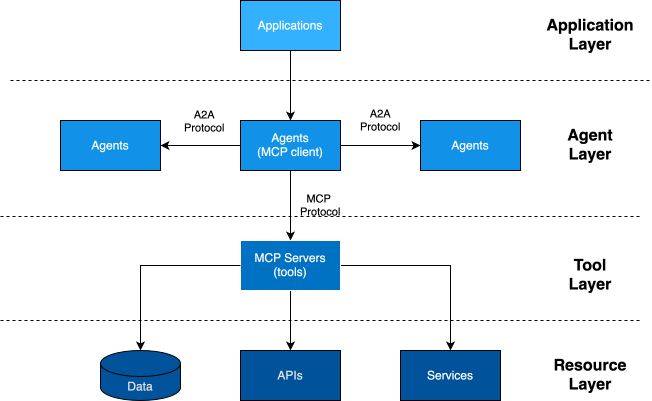
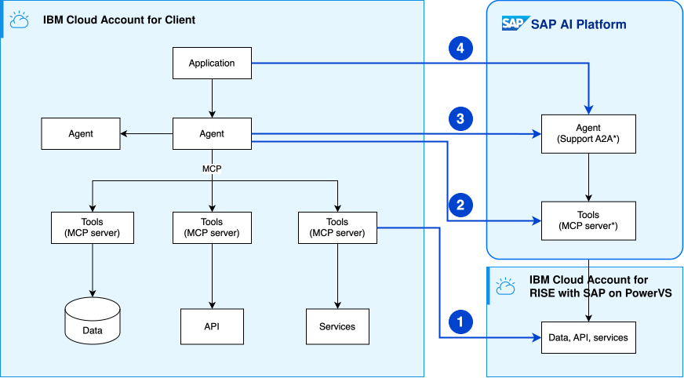
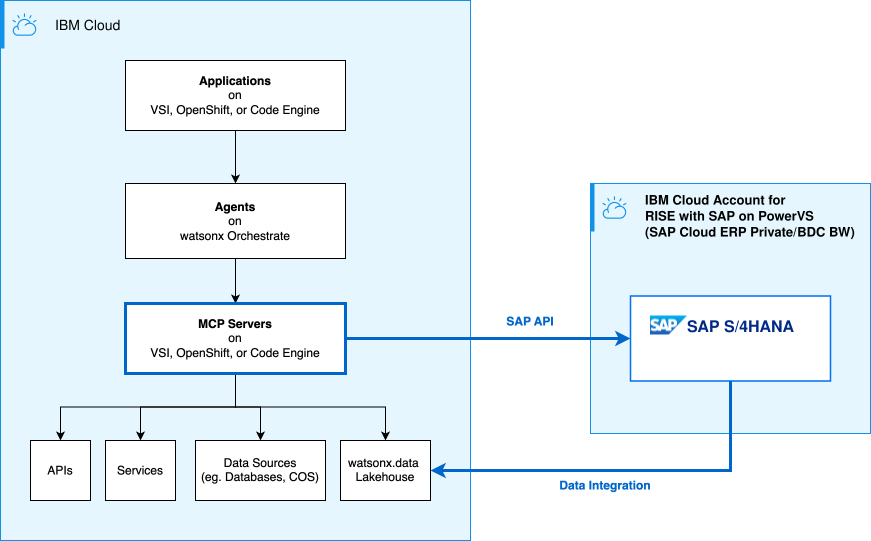
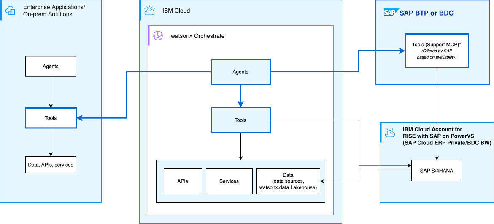
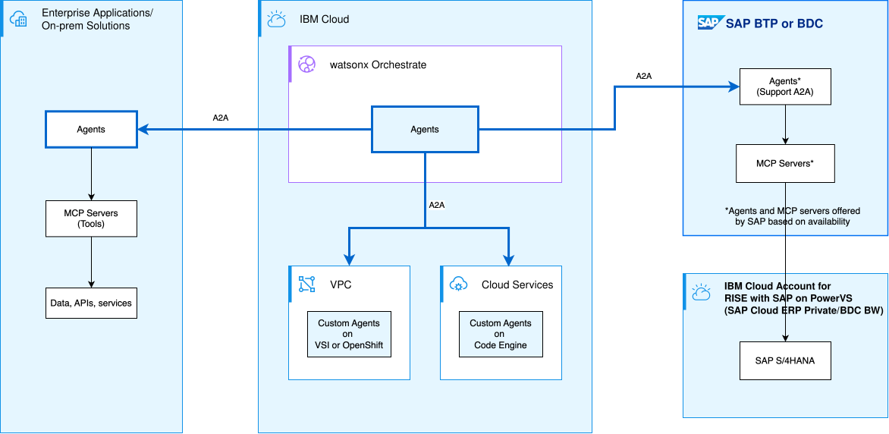
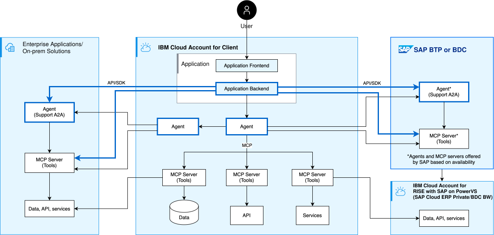

---

copyright:
  years: 2025
lastupdated: "2026-06-14"

keywords: SAP, RISE, PowerVS, RISE with SAP on PowerVS, SAP on IBM Cloud, Benefits of RISE with SAP on IBM Cloud, IBM Power Virtual Server, SAP modernization

subcollection: rise-with-sap-on-powervs

---

{{site.data.keyword.attribute-definition-list}}

# Agentic AI for SAP Applications with IBM {{site.data.keyword.powerSys_notm}}
{: #solution-agentic-ai}

## Introduction
{: #solution-agentic-ai-introduction}

This guide covers building Agentic AI solutions on IBM Cloud that integrate with SAP data and resources as surround workloads. These solutions leverage autonomous agents that can reason, plan, and execute tasks using tools and data sources. By connecting to RISE with SAP environments, Agentic AI enables automation of complex SAP business processes and provides intelligent enterprise assistance.

---

## Agentic AI Architecture Layers
{: #solution-agentic-ai-architecture-layers}

Agentic AI solutions are built on multiple interconnected layers, each serving a specific purpose in the overall architecture:

{: caption="IBM Cloud Agentic AI Architecture Layers" caption-side="bottom"}

### 1. Resource Layer
{: #solution-agentic-ai-architecture-layers-resource}

The Resource Layer represents all enterprise resources including data, APIs, and services across the landscape. This foundational layer provides the information and capabilities that agents access and process, supporting diverse locations and formats to meet enterprise requirements.

**Location Flexibility:**
- **On-Premises**: Legacy systems, SAP ERP, databases
- **Cloud**: {{site.data.keyword.cos_full_notm}}, {{site.data.keyword.databases-for}}, {{site.data.keyword.lakehouse_short}}
- **Multi-Cloud**: AWS S3, Azure Blob Storage, Google Cloud Storage
- **Hybrid**: Combination of on-premises and cloud data sources

**Key Characteristics:**
- Data can reside anywhere in the enterprise landscape
- Supports structured, semi-structured, and unstructured data
- Enables real-time and batch data access patterns
- Maintains data sovereignty and compliance requirements

### 2. Tool Layer
{: #solution-agentic-ai-architecture-layers-tool}

The Tool Layer provides the interface that exposes enterprise capabilities and services to agents through standardized protocols. Tools abstract complex operations into simple, reusable functions that agents can invoke.

**Integration Capabilities:**
- **Data Source Integration**: Connect to databases, data lakes, and data warehouses
- **API Integration**: REST APIs, GraphQL, SOAP services (SAP OData, third-party APIs)
- **Platform Integration**: IBM Cloud services, enterprise platforms, SaaS applications

**Custom Tool Development:**
- **Business-Specific Functions**: Domain-specific operations and workflows
- **Utility Functions**: Reusable helper functions and transformations
- **Composite Tools**: Tools that orchestrate multiple integration capabilities

**Tool Characteristics:**
- Tools abstract complex operations into simple, reusable functions
- Can be local (embedded) or remote (via MCP servers)
- Support synchronous and asynchronous operations
- Enable secure access to enterprise resources

### 3. Agent Layer
{: #solution-agentic-ai-architecture-layers-agent}

The Agent Layer consists of intelligent orchestrators powered by Large Language Models (LLMs) that use tools to accomplish tasks autonomously. Agents can reason, maintain context, and coordinate with other agents to solve complex business problems.

**Agent Capabilities:**
- **Tool Utilization**: Agents use tools from local or remote MCP (Model Context Protocol) servers
- **Reasoning**: LLM-powered decision making and planning
- **Memory**: Maintain context and conversation history
- **Orchestration**: Coordinate multiple tools and sub-agents

**Agent Communication:**
- **Local MCP Servers**: Direct integration with tools in the same environment
- **Remote MCP Servers**: Distributed tool access across network boundaries
- **Agent-to-Agent (A2A) Protocol**: Inter-agent communication for complex workflows
- **Multi-Agent Systems**: Collaborative problem-solving with specialized agents

### 4. Application Layer
{: #solution-agentic-ai-architecture-layers-app}

The Application Layer represents user-facing interfaces and backend services that interact with agents to deliver AI-powered experiences. This layer enables various integration patterns to connect applications with agent capabilities.

**Integration Patterns:**
- **Direct Integration**: Applications embed agents using platform SDKs (e.g., watsonx.orchestrate SDK) or invoke tightly coupled agent services
- **API-based Integration**: Applications communicate with agents through exposed REST APIs and streaming protocols

**Application Types:**
- Web applications (React, Angular, Vue.js)
- Mobile applications (iOS, Android)
- Enterprise applications (SAP Fiori, custom portals)
- Backend services and microservices

---

## SAP Integration Patterns
{: #solution-agentic-ai-sap-integration-patterns}

Four primary patterns connect Agentic AI solutions with RISE with SAP. Each addresses different integration needs and can be combined for comprehensive solutions.

{: caption="Agent integration patterns" caption-side="bottom"}

### Pattern 1: MCP Server Integration with SAP
{: #solution-agentic-ai-sap-integration-patterns-1}

**Overview:**
MCP (Model Context Protocol) servers provide the integration layer between agents and SAP systems, exposing tools that abstract SAP operations for agent consumption.

**Key Characteristics:**
- Direct SAP API connections (OData, REST, BAPI, RFC) for real-time operations
- Access to SAP data via {{site.data.keyword.lakehouse_short}} for analytics and ML workloads
- Tool-based abstraction of SAP operations
- Reusable across multiple agents
- Centralized SAP connectivity

**Key Use Case Examples:**

1. **Real-time Inventory Management**
   - E-commerce platforms checking product availability across SAP warehouses
   - MCP server exposes tool to query SAP S/4HANA for inventory status
   - Example: Customer adds item → Agent calls MCP tool → Returns SAP inventory status

2. **Automated Purchase Order Processing**
   - Procurement automation based on inventory thresholds
   - MCP server provides tool to invoke SAP BAPI for purchase order creation
   - Example: Low inventory detected → Agent creates PO via MCP tool → Routes for approval

**Architecture:**

{: caption="MCP Server Integration with SAP" caption-side="bottom"}

Agents invoke tools on the MCP server, which translates requests into SAP API calls or accesses SAP data via watsonx.data Lakehouse for analytics workloads. This pattern centralizes SAP connectivity through MCP servers deployed on IBM Cloud, providing reusable tools for multiple agents.

MCP servers can access SAP data using multiple integration patterns optimized for different use cases—from real-time API queries (via SAP API) to analytics via watsonx.data (via Data Integration) to ML-powered enrichment. The diagram illustrates these two primary data integration paths. For detailed guidance on implementing these data integration approaches, see [SAP Data Integration Patterns for IBM Cloud](solution-guides-data-integration.md).

**Supporting IBM Cloud Services:**
- **{{site.data.keyword.codeenginefull_notm}} / {{site.data.keyword.openshiftshort}}**: Host MCP servers with auto-scaling and container orchestration
- **{{site.data.keyword.lakehouse_short}}**: Unified data access for SAP and enterprise data sources (for analytics-focused tools)
- **{{site.data.keyword.vpc_short}}**: Provide isolated network environment for secure SAP connectivity
- **{{site.data.keyword.secrets-manager_full_notm}}**: Store and manage SAP credentials and API keys securely
- **{{site.data.keyword.dlc_full_notm}}**: Enable low-latency, dedicated connection to on-premises SAP systems

---

### Pattern 2: Agent Integration with SAP MCP Servers
{: #solution-agentic-ai-sap-integration-patterns-2}

**Overview:**
Agents on {{site.data.keyword.wxorchestrate_short}} consume MCP server tools to interact with SAP, enabling reasoning about SAP data and executing operations.

**Key Use Case Examples:**

1. **Intelligent Order Processing**
   - Customer service agent handles complex order inquiries with natural language understanding
   - Multi-step reasoning: check inventory → verify pricing → update order
   - Example: "Change order #12345 to expedited shipping" → Agent processes → Updates SAP → Confirms

2. **Financial Reconciliation**
   - Automated invoice matching and payment processing with exception handling
   - Example: Payment received → Matches invoices → Identifies discrepancies → Creates follow-up tasks

**Architecture:**
{: caption="Agent Integration with SAP MCP Servers" caption-side="bottom"}

Agents on {{site.data.keyword.wxorchestrate_short}} discover and invoke tools through the MCP Server Registry, which routes requests to appropriate SAP MCP Servers, if available. These MCP servers provide tools that enable agents to interact with SAP systems, with the implementation details (such as whether they use SAP APIs, direct database access, or other integration methods) determined by how SAP or third-party providers implement their MCP servers. This enables intelligent reasoning and multi-step operations across SAP systems.

**Supporting IBM Cloud Services:**
- **{{site.data.keyword.wxorchestrate_short}}**: Provide agent platform with pre-built templates and workflow automation
- **watsonx.ai**: Supply foundation models for agent reasoning and natural language understanding
- **{{site.data.keyword.vpc_short}}**: Ensure secure, isolated network for agent and MCP server communication
- **App ID**: Manage user authentication and authorization for agent access
- **{{site.data.keyword.secrets-manager_full_notm}}**: Securely store SAP credentials used by MCP servers

---

### Pattern 3: Agent-to-Agent Communication (A2A)
{: #solution-agentic-ai-sap-integration-patterns-3}

**Overview:**
Agents collaborate on complex multi-domain tasks, enabling task delegation and result aggregation across specialized agents. The A2A (Agent-to-Agent) protocol is the recommended standardized approach for inter-agent communication, though alternative methods such as REST APIs, message queues, or event streams may be used based on specific requirements.

**Key Characteristics:**
- Distributed architecture with specialized agents
- A2A protocol recommended for standardized communication
- Alternative methods available (REST APIs, message queues, event streams)
- Asynchronous communication
- Task decomposition and delegation

**Key Use Case Examples:**

1. **End-to-End Order Fulfillment**
   - Orchestrator coordinates sales, inventory, logistics, and finance agents
   - Flow: Order placed → Orchestrator delegates → Agents execute → Results aggregated → Order confirmed
   - Benefits: Parallel processing, specialized expertise, fault tolerance

2. **Intelligent Procurement with External Suppliers**
   - Internal procurement agent collaborates with external supplier agents
   - Flow: Low inventory → Request quotes → Evaluate options → Create PO
   - Benefits: Real-time negotiation, competitive pricing, automation

**Architecture:**
{: caption="Agent-to-Agent Communication (A2A)" caption-side="bottom"}

An orchestrator agent coordinates specialized agents for task delegation and result aggregation, with internal agents communicating with each other and external partner agents to execute complex multi-domain workflows. The A2A protocol is recommended for this communication, with alternative methods available based on implementation needs.

**Supporting IBM Cloud Services:**
- **{{site.data.keyword.codeengineshort}} / {{site.data.keyword.openshiftshort}}**: Deploy and scale multiple specialized agents with container orchestration
- **{{site.data.keyword.vpc_short}}**: Create secure network boundaries for internal and external agent communication
- **{{site.data.keyword.messagehub}}**: Enable asynchronous messaging and event-driven agent coordination
- **{{site.data.keyword.apiconnect_short}}**: Manage and secure A2A protocol endpoints with rate limiting and monitoring
- **{{site.data.keyword.secrets-manager_short}}**: Store credentials for inter-agent authentication and system access

**Security:** Mutual TLS, OAuth 2.1, end-to-end encryption, rate limiting, audit logging

---

### Pattern 4: Application Integration with SAP Agents and MCP Servers
{: #solution-agentic-ai-sap-integration-patterns-4}

**Overview:**
Applications (web, mobile, enterprise) can integrate with SAP systems through two approaches: SAP-enabled agents for intelligent, conversational interfaces with reasoning capabilities, or direct MCP server integration for straightforward SAP operations without agent reasoning.

**Key Use Case Examples:**

1. **Conversational E-commerce**
   - AI-powered shopping assistant with SAP inventory integration
   - Example: "Show blue running shoes size 10" → Agent searches SAP → Returns results

2. **Mobile Field Service**
   - Field technicians access SAP work orders via mobile app with offline capability
   - Example: "What's my next appointment?" → Agent retrieves SAP schedule

3. **SAP Fiori AI Copilot**
   - Embedded AI assistant in SAP Fiori apps
   - Example: "Summarize customer order history" → Copilot analyzes → Provides insights

**Architecture:**
{: caption="Application Integration with SAP Agents" caption-side="bottom"}

Applications can integrate with SAP systems through two primary paths:

1. **Agent-mediated integration**: Applications invoke SAP-enabled agents that use MCP servers for intelligent, conversational interfaces with reasoning capabilities
2. **Direct MCP integration**: Applications directly access MCP server tools for straightforward SAP operations without agent reasoning

While applications can also integrate directly with SAP data sources (databases, APIs) without agents or MCP servers, this traditional integration approach is not the focus of Agentic AI patterns and is not covered in this guide.
{: note}

**Integration Methods:**

*For Agent Integration:*
- **Agent SDKs**: Platform-specific SDKs (e.g., watsonx.orchestrate SDK) for embedded agent capabilities
- **REST APIs**: HTTP/REST endpoints for invoking agent conversations and workflows
- **Streaming Protocols**: WebSocket for bidirectional communication or Server-Sent Events (SSE) for server-to-client streaming of agent responses

*For Direct MCP Integration:*
- **MCP Client SDKs**: MCP client libraries (TypeScript, Python) for direct protocol-level integration with stdio or SSE transports
- **REST APIs**: HTTP/REST endpoints exposed by MCP servers for language-agnostic tool invocation
- **Streaming Protocols**: WebSocket for interactive sessions or SSE for streaming tool execution results

In many deployments, an API Gateway sits in front of the application backend, agent APIs, or MCP servers to provide authentication, routing, rate limiting, and observability. The application backend manages business logic and coordinates requests to either agents or MCP servers based on the use case requirements. Remote agents remain an API-based integration variant from the application's perspective, while agent-to-agent collaboration is handled separately through A2A patterns.

**Supporting IBM Cloud Services:**
- **{{site.data.keyword.codeengineshort}} / {{site.data.keyword.openshiftshort}}**: Host application backends and agent services with scalability
- **{{site.data.keyword.apiconnect_short}}**: Provide API gateway for authentication, routing, and rate limiting
- **{{site.data.keyword.vpc_short}}**: Ensure secure communication between application layers
- **{{site.data.keyword.appid_short}}**: Manage end-user authentication and single sign-on
- **{{site.data.keyword.objectstorageshort}}**: Store application data, logs, and agent conversation history
- **{{site.data.keyword.databases-for}}**: Provide persistent storage for application state and user data

---

## Integration Pattern Comparison
{: #solution-agentic-ai-integration-pattern-comparison}

| Pattern | Design Effort | Response Time | Scalability | Best For |
|---------|--------------|---------------|-------------|----------|
| **MCP-SAP** | Medium - Design MCP server, implement SAP API integration | Variable (typically Low-Medium) - Depends on SAP system and network latency | High - Stateless operations | Direct SAP operations, CRUD |
| **Agent-MCP** | Medium-High - Agent logic plus MCP server | Variable (typically Medium) - SAP latency plus LLM reasoning time | High - Parallel agent instances | Conversational interfaces |
| **A2A** | High - Multi-agent coordination, protocol implementation | Variable (typically Medium-High) - Multiple agent hops, coordination overhead | Very High - Distributed architecture | Complex workflows |
| **App-Agent** | Low-Medium to Medium - Depends on integration approach (SDK vs custom) | Variable (Low-Medium to Medium) - Depends on integration path (direct MCP vs agent-mediated) | High - Application scaling | End-user applications |
{: caption="Integration pattern comparison" caption-side="top"}

**Metric Definitions:**

- **Design Effort**
    - **Low**: Minimal custom code, leverage existing services and templates
    - **Low-Medium**: Some custom integration logic, configuration required
    - **Medium**: Moderate development, custom agent logic and integration
    - **High**: Significant custom development, complex architecture design

- **Response Time**
    - **Low (ms)**: Sub-second response - Simple operations without LLM reasoning
    - **Low-Medium**: Few seconds - API operations with light processing
    - **Medium (seconds)**: Several seconds - Single agent with LLM reasoning
    - **Medium-High (seconds)**: Multiple seconds - Multi-agent coordination, complex workflows

- **Scalability**
    - **High**: Supports hundreds to thousands of concurrent operations
    - **Very High**: Supports thousands to tens of thousands of concurrent operations with horizontal scaling

**Selection Guidance:** Choose based on requirements; patterns can be combined for comprehensive solutions (e.g., MCP-SAP for data access + Agent-MCP for reasoning + A2A for complex workflows)

---

## Deployment & Decision Factors
{: #solution-agentic-ai-deployment-decision-factors}

### Key Decision Areas
{: #solution-agentic-ai-deployment-decision-factors-decision-areas}

| Factor | Key Considerations | Recommendation |
|--------|-------------------|----------------|
| **Data Location** | Regulatory requirements, latency, bandwidth | Use Direct Link for on-premises; {{site.data.keyword.lakehouse_short}} for multi-cloud federation |
| **Agent Scale** | 1-5 agents: {{site.data.keyword.codeengineshort}}; 20+: OpenShift | Start serverless, scale to containers as complexity grows |
| **MCP Deployment** | Variable load: {{site.data.keyword.codeengineshort}}; Consistent: OpenShift | Hybrid approach for mixed workloads |
| **Integration Pattern** | Choose based on complexity: MCP-SAP for direct operations, Agent-MCP for reasoning, A2A for workflows, App-Agent for user interfaces | Combine patterns based on use case; see [Data Integration guide](solution-guides-data-integration.md) for data-centric patterns |
| **Cost** | Serverless for variable, reserved for predictable | Monitor and right-size resources |
| **Security** | Encryption, least-privilege, audit logging | Use Secrets Manager, enable compliance monitoring |
| **Performance** | Multi-zone deployment, load balancing | Design for HA with disaster recovery |
{: caption="Key decision areas" caption-side="top"}

---

## Deployment Patterns
{: #solution-agentic-ai-deployment-patterns}

### IBM Cloud-Based Deployment
{: #solution-agentic-ai-deployment-patterns-ibmcloud}

Applications, agents, and MCP servers deployed on IBM Cloud infrastructure using managed services ({{site.data.keyword.codeengineshort}}/OpenShift, {{site.data.keyword.wxorchestrate_short}}, {{site.data.keyword.lakehouse_short}}) for unified data access.

### Hybrid with External Agents
{: #solution-agentic-ai-deployment-patterns-hybrid}

IBM Cloud agents communicate with external/partner agents via A2A protocol for multi-organization workflows.

### Edge-to-Cloud
{: #solution-agentic-ai-deployment-patterns-edge}

Local agents at edge/on-premises for low-latency processing, with cloud agents for complex tasks and scalability.

> **Reference**: For detailed workflow patterns, see [IBM Cloud Agentic AI Workflow Documentation](/docs/pattern-agentic-platform?topic=pattern-agentic-platform-agentic-ai-workflow).

---

## IBM Cloud Services for Agentic AI
{: #solution-agentic-ai-ibmcloud-services}

### Core Services
{: #solution-agentic-ai-ibmcloud-services-core-services}

| Service | Purpose | Key Capabilities |
|---------|---------|------------------|
| **{{site.data.keyword.wxorchestrate_short}}** | Agent platform | Pre-built templates, workflow automation, multi-agent coordination |
| **watsonx.ai** | Foundation models | LLM access, fine-tuning, prompt engineering, model governance |
| **{{site.data.keyword.lakehouse_short}}** | Data lakehouse | Multi-source integration, query federation, SAP connectivity |
| **watsonx.governance** | AI governance | Model lifecycle management, risk assessment, compliance monitoring, audit trails |
| **{{site.data.keyword.codeengineshort}}** | Serverless compute | MCP servers, auto-scaling, pay-per-use, zero infrastructure |
| **OpenShift** | Enterprise Kubernetes | Production deployments, service mesh, multi-zone HA |
| **{{site.data.keyword.objectstorageshort}}** | Scalable storage | Unstructured data, data lake, backups, AI training data |
| **{{site.data.keyword.databases-for}}** | Managed databases | PostgreSQL, MongoDB, Redis, Elasticsearch |
| **{{site.data.keyword.vpc_short}}** | Private networking | Isolated subnets, security groups, VPN gateway, load balancers |
| **{{site.data.keyword.dl_short}}** | Dedicated connection | Low-latency SAP access, high bandwidth, compliance |
| **{{site.data.keyword.messagehub}}** | Event streaming | Real-time SAP events, agent communication, Kafka-based |
| **{{site.data.keyword.secrets-manager_short}}** | Secrets management | SAP credentials, API keys, automatic rotation |
| **{{site.data.keyword.apiconnect_short}}** | API gateway | Authentication, routing, rate limiting, API lifecycle management |
| **{{site.data.keyword.appid_short}}** | User authentication | SSO, OAuth 2.1, user management, multi-factor authentication |
| **{{site.data.keyword.openwhisk_short}}** | Serverless functions | Event-driven processing, lightweight compute, pay-per-execution |
| **{{site.data.keyword.mon_full_notm}}** | Infrastructure monitoring | Metrics, dashboards, alerts, performance monitoring |
| **{{site.data.keyword.loganalysisfull_notm}}** | Log management | Centralized logging, search, filtering, real-time analysis |
| **{{site.data.keyword.sysdigsecure_full_notm}}** | Security posture | Compliance monitoring, threat detection, audit logging |
{: caption="Core services" caption-side="top"}

---

---

## Conclusion
{: #solution-agentic-ai-conclusion}

Building Agentic AI solutions on IBM Cloud with RISE with SAP integration requires careful consideration of architecture patterns and integration approaches. This guide provides four primary integration patterns—MCP Server Integration, Agent-MCP Integration, Agent-to-Agent Communication, and Application Integration—each addressing different use cases and complexity levels.

Key takeaways:
- **Layered Architecture**: Understand the four layers (Resource, Tool, Agent, Application) and how they interact
- **Integration Patterns**: Select appropriate patterns based on your use case—from direct SAP operations to complex multi-agent workflows
- **Flexible Deployment**: Leverage IBM Cloud services ({{site.data.keyword.codeengineshort}}, OpenShift, {{site.data.keyword.wxorchestrate_short}}, {{site.data.keyword.lakehouse_short}}) based on your requirements
- **Pattern Combination**: Combine multiple patterns for comprehensive solutions that address diverse business needs

For detailed implementation guidance, refer to the [IBM Cloud Agentic AI Workflow Pattern](/docs/pattern-agentic-platform?topic=pattern-agentic-platform-agentic-ai-workflow) and [SAP Data Integration Patterns](solution-guides-data-integration.md).

---

## Additional Resources
{: #solution-agentic-ai-additional-resources}

### IBM Cloud Documentation
{: #solution-agentic-ai-additional-resources-ibm-cloud-documentation}

- [IBM Cloud Agentic AI Workflow Pattern](/docs/pattern-agentic-platform?topic=pattern-agentic-platform-agentic-ai-workflow) - **Primary Reference**
- [Accelerate Gen AI on IBM Cloud with Deployable Architectures](https://developer.ibm.com/tutorials/awb-maximize-gen-ai-on-ibm-cloud-deployable-architectures/)
- [IBM {{site.data.keyword.wxorchestrate_short}} Documentation](https://www.ibm.com/docs/en/watsonx/orchestrate)
- [{{site.data.keyword.codeenginefull_notm}}](/docs/codeengine)
- [Red Hat OpenShift on IBM Cloud](/docs/openshift)
- [{{site.data.keyword.lakehouse_short}} Documentation](https://www.ibm.com/docs/en/watsonxdata/standard)

### External Resources
{: #solution-agentic-ai-additional-resources-external-resources}

- [SAP API Business Hub](https://api.sap.com/)
- [Model Context Protocol (MCP) Specification](https://modelcontextprotocol.io/docs/getting-started/intro)
- [Agent-to-Agent (A2A) Protocol](https://a2a.ai/)
