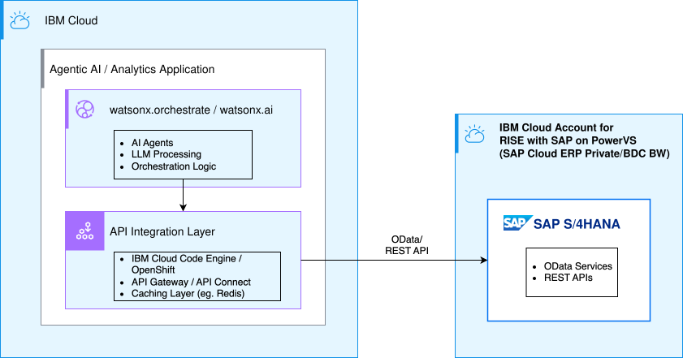
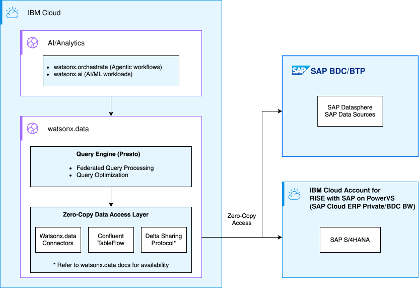
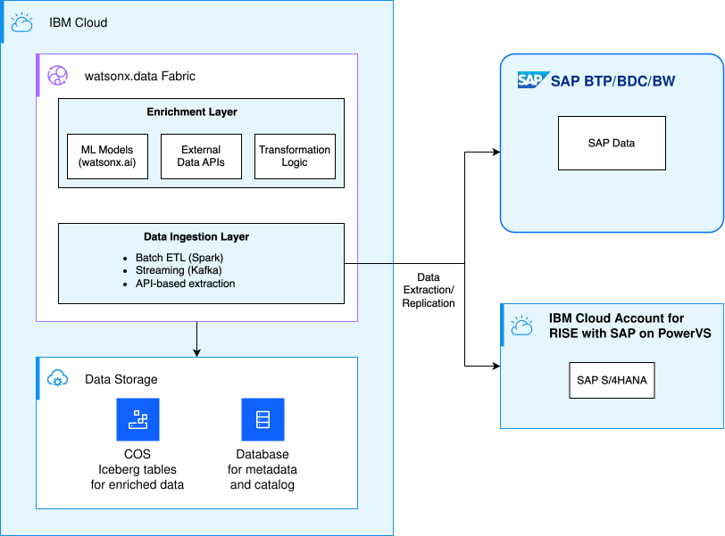

---

copyright:
  years: 2025
lastupdated: "2026-06-15"

keywords: SAP, RISE, PowerVS, RISE with SAP on PowerVS, SAP on IBM Cloud, Benefits of RISE with SAP on IBM Cloud, IBM Power Virtual Server, SAP modernization

subcollection: rise-with-sap-on-powervs

---

{{site.data.keyword.attribute-definition-list}}

# Data integration
{: #solution-data-integration}

## Overview
{: #solution-data-integration-overview}

This guide presents three integration patterns for consuming SAP data in IBM Cloud environments while maintaining compliance with SAP's usage terms and conditions. Each pattern is optimized for specific use cases—from real-time queries to complex analytics and ML workloads.

### Key Principles
{: #solution-data-integration-overview-key-principles}

All patterns follow these core principles:

* **Compliance-First**: Use SAP-approved APIs and methods (e.g., OData, SAP BDC Connect); avoid unauthorized database access or permanent replication of original SAP data
* **Zero-Copy Preferred**: Minimize data movement to reduce costs and complexity where possible
* **Consume and Materialize**: SAP data can be consumed via approved connectors and temporarily materialized in third-party systems (like watsonx.data) for performance optimization—caching data to speed up queries without constantly accessing SAP sources
* **Enrich and Transform**: Materialized data can be enriched through joins, AI processing, ML predictions, and integration with external data sources; enriched/transformed data can be stored indefinitely as it becomes distinct from original SAP Data Products
* **No Downstream Distribution**: Data cannot be distributed to subsequent systems outside the approved ecosystem; third-party systems serve as processing endpoints, not pass-through pipelines
* **Flexible Architecture**: Support diverse use cases from agentic AI to business intelligence while maintaining SAP compliance

## SAP Data Integration Patterns
{: #solution-data-integration-patterns}

This guide presents three complementary patterns for SAP data integration:

**Pattern 1: API-Based Integration**
- Direct, real-time API access to SAP data using SAP-approved protocols
- Ideal for real-time queries, agentic AI, and low-volume access scenarios

**Pattern 2: Federated and Streaming Data Access via watsonx.data**
- Access SAP data for large-scale analytics using federated queries or event streaming
- Three sub-patterns:
    - **2A - Native Connectors**: Federated queries using built-in watsonx.data connectors
    - **2B - Streaming Integration**: Near-real-time analytics with event streaming to data lakehouse
    - **2C - Delta Sharing**: Access via SAP Datasphere and Delta Sharing protocol
- Best for large-scale analytics and multi-source integration

**Pattern 3: Data Enrichment in watsonx.data Fabric**
- Selective data extraction with temporary materialization for enrichment
- Combine SAP data with ML predictions, external data, and derived metrics
- Optimized for ML/AI training, complex transformations, and predictive analytics

---

## Pattern 1: API-Based Integration
{: #solution-data-integration-pattern1}

### Overview
{: #solution-data-integration-pattern1-overview}

Direct API access to SAP data for real-time queries using SAP-approved protocols. Data is consumed on-demand without storage, making it ideal for agentic AI and low-volume access scenarios.

**Pattern Characteristics:**
- **Data Movement**: None—consume on-demand
- **Complexity**: Low
- **Cost**: Low
- **Example Use Case**: Customer service chatbot querying order status

### Architecture
{: #solution-data-integration-pattern1-architecture}

**Architecture Diagram:**

{: caption="SAP Data Integration Pattern 1" caption-side="bottom"}

**Architecture Components:**

**API Integration Layer:**

The API integration layer mediates between SAP systems and consuming applications. It includes both the compute infrastructure and the integration applications running on it.

**Compute Infrastructure:**
- **{{site.data.keyword.codeengineshort}}** (recommended): Serverless compute with automatic scaling and pay-per-use pricing
- **{{site.data.keyword.openshiftshort}}** (alternative): Enterprise Kubernetes for complex microservices and existing OpenShift investments

**Integration Applications:**
- **MCP Servers**: Expose SAP data access as tools for AI agents (e.g., `get_order_status`, `check_inventory`)
- **Custom Integration Services**: Handle SAP API calls, implement business logic, data transformation, and orchestration
- **Authentication Handlers**: Manage OAuth tokens, certificates, and credential rotation using methods such as OAuth 2.1 (recommended), certificate-based authentication, or basic auth (development only)

**API Protocols:**

SAP systems expose data through multiple API protocols, each suited for different use cases:
- **OData (Recommended)**: SAP's standard RESTful protocol for data access. Provides standardized query capabilities, filtering, and pagination. Best for modern integrations, analytics, and AI/ML workloads.
- **REST APIs**: Direct HTTP/REST endpoints via SAP Gateway and SAP Cloud Platform. Flexible for custom integrations and microservices architectures.
- **SOAP/Web Services**: XML-based protocol for enterprise integrations. Legacy but still widely used in existing SAP landscapes and enterprise service buses.
- **RFC (Remote Function Call)**: SAP's proprietary protocol for direct function calls. Typically used for high-volume batch processing and system-to-system integrations.
- **GraphQL**: Emerging protocol in SAP BTP and cloud solutions. Enables flexible, client-driven queries with precise data fetching in cloud environments.
- **SAP Business API**: Modern API framework in S/4HANA Cloud with pre-built business logic and standardized interfaces.

**Supporting Services:**
- **watsonx.ai / {{site.data.keyword.wxorchestrate_short}}**: AI runtime for agentic workflows and LLM processing
- **{{site.data.keyword.apiconnect_short}}** (optional): API management, rate limiting, and security policies
- **{{site.data.keyword.databases-for-redis}}** (optional): Caching layer for improved performance
- **{{site.data.keyword.secrets-manager_short}}**: Secure storage for SAP credentials and API keys

**Network Connectivity:**

Multiple connectivity options are available including public internet, Direct Link, VPN, and SAP Private Link. For detailed guidance on selecting and implementing these options, see [Integration Overview](../integration/integration-overview.md).

**Agentic AI Integration:**

Pattern 1 enables real-time SAP data access for agentic AI applications through MCP (Model Context Protocol) servers. Agents can query SAP data on-demand for conversational queries, order status lookups, and other real-time operations. For comprehensive guidance on building agentic AI solutions that integrate with SAP, see [Agentic AI for SAP Applications](solution-guides-agentic-ai.md).

### When to Use This Pattern
{: #solution-data-integration-pattern1-when-to-use}

- ✅ Real-time data freshness is critical
- ✅ Low to moderate query volumes
- ✅ Agentic AI conversational queries
- ✅ Minimal infrastructure preferred
- ❌ Avoid for high-volume analytics or complex joins

### Use Cases
{: #solution-data-integration-pattern1-usecases}

**Real-World Examples:**
- **Customer Service Chatbots**: Query order status, delivery information, or customer details in real-time
- **Sales Agent Tools**: Check inventory availability, pricing, or customer credit limits during sales calls
- **Executive Dashboards**: Display live KPIs and metrics without data replication
- **On-Demand Reports**: Generate financial or operational reports with current data

### Considerations
{: #solution-data-integration-pattern1-considerations}

**Trade-offs:**

*Advantages:*
- ✅ **Simple Architecture**: Easy to implement and maintain with minimal infrastructure
- ✅ **Low Cost**: No storage costs, pay only for compute and API calls
- ✅ **Always Current**: Queries always return the latest data from SAP

*Limitations:*
- ⚠️ **Network Latency**: Each query requires a round-trip to SAP, impacting response times
- ⚠️ **API Rate Limits**: Subject to SAP API throttling and quotas
- ⚠️ **Limited Analytics**: Not suitable for complex joins, aggregations, or high-volume queries
- ⚠️ **Availability Dependency**: Requires SAP system to be available for all queries

**Implementation Best Practices:**
- **Security**: Use OAuth 2.1 for authentication; store credentials in Secrets Manager
- **Performance**: Cache reference data intelligently; optimize queries with protocol-specific options (e.g., OData $filter, $select)
- **Resilience**: Implement retry logic with exponential backoff; add circuit breakers
- **Monitoring**: Track response times, error rates, and API quota usage
- **Error Handling**: Provide graceful degradation when SAP is unavailable

---

## Pattern 2: Federated and Streaming Data Access via watsonx.data
{: #solution-data-integration-pattern2}

### Overview
{: #solution-data-integration-pattern2-overview}

Access SAP data for large-scale analytics using watsonx.data. This pattern offers three complementary sub-patterns that support both zero-copy access and selective event materialization, making it ideal for large-scale analytics and multi-source integration.

**Three Sub-Patterns:**

**2A - Native Connectors:**
- Federated queries using built-in watsonx.data connectors
- Query SAP data directly without data movement
- Best for: Batch analytics, scheduled reports, ad-hoc queries

**2B - Streaming Integration (Event-Driven):**
- Near-real-time analytics with event streaming to data lakehouse
- SAP change data capture (CDC) events stream through a managed Kafka service to watsonx.data (Iceberg, Parquet, or other formats)
- **Note**: Events are materialized in the lakehouse for persistent history and fast analytics
- Enables reactive automation and immediate response to SAP changes
- Best for: Real-time dashboards, event-driven workflows, continuous analytics, audit trails
- **Architecture**: SAP CDC events → Managed Kafka ({{site.data.keyword.messagehub}} or Confluent Cloud) → watsonx.data lakehouse
- **Use cases**: Order processing automation, inventory alerts, real-time customer analytics

**2C - Delta Sharing:**
- Access via SAP Datasphere using Delta Sharing protocol
- SAP-native governance and access controls
- Best for: Organizations with SAP Datasphere, strict data residency requirements

**Pattern Characteristics:**
- **Data Movement**: Minimal/None (2A, 2C) or Selective event streaming (2B)
- **Complexity**: Medium-High
- **Cost**: Medium
- **Example Use Case**: Cross-system financial consolidation

### Architecture
{: #solution-data-integration-pattern2-architecture}

**Architecture Diagram:**

{: caption="SAP Data Integration Pattern 2" caption-side="bottom"}


**Architecture Components:**

**Supporting IBM Cloud Services:**
- **{{site.data.keyword.lakehouse_short}}**: Lakehouse platform with Presto query engine for federated queries
- **watsonx.ai**: AI/ML workloads and model training on federated data
- **{{site.data.keyword.cos_short}}**: Storage for query results and metadata caching
- **{{site.data.keyword.messagehub}}** (for 2B): Managed Apache Kafka for streaming SAP CDC events
- **{{site.data.keyword.vpc_short}}**: Secure network isolation for data access

**Network Connectivity:**

Multiple connectivity options are available including Direct Link (recommended for production), VPN, and SAP Private Link. For detailed guidance on selecting and implementing these options, see [Integration Overview](../integration/integration-overview.md).

**Authentication Methods:**
- **OAuth 2.1**: Token-based authentication for SAP APIs
- **Certificate-based**: Mutual TLS for highest security
- **RBAC**: Role-based access control in watsonx.data

### When to Use This Pattern
{: #solution-data-integration-pattern2-when-to-use}

- ✅ Large-scale analytics workloads
- ✅ Multi-source data integration (SAP + non-SAP)
- ✅ Cost-sensitive scenarios (minimize storage)
- ✅ Need to combine data from multiple sources
- ❌ Avoid for simple queries or extensive transformations

### Use Cases
{: #solution-data-integration-pattern2-usecases}

**Real-World Examples:**
- **Cross-System Financial Consolidation**: Combine financial data from multiple SAP instances and external systems for enterprise-wide reporting
- **Customer 360 Views**: Integrate SAP customer data with CRM, social media, and support systems for complete customer intelligence
- **Supply Chain Analytics**: Analyze supply chain data across multiple SAP instances, IoT sensors, and external logistics providers
- **Multi-Cloud Analytics**: Federate queries across SAP on IBM Cloud and data in other cloud platforms

### Considerations
{: #solution-data-integration-pattern2-considerations}

**Advantages:**
- ✅ **Flexible Access**: Zero-copy federated queries (2A, 2C) or event streaming (2B) based on needs
- ✅ **Scalable**: Handle large-scale analytics workloads efficiently
- ✅ **Multi-Source**: Combine SAP and non-SAP data in single queries
- ✅ **Cost-Effective**: Minimize storage costs with federated queries; optimize performance with selective event streaming

**Limitations:**
- ⚠️ **Complex Setup**: Requires watsonx.data infrastructure and configuration
- ⚠️ **Network Dependency**: Query performance depends on network latency
- ⚠️ **Infrastructure Required**: Need watsonx.data platform

**Best Practices:**
- **Sub-Pattern Selection**: Choose 2A for simplicity, 2B for real-time needs, 2C for true zero-copy with Datasphere
- **Network**: Use Direct Link for production workloads to minimize latency
- **Caching**: Implement intelligent caching for frequently accessed data
- **Security**: Use least privilege access controls and comprehensive audit logging
- **Monitoring**: Track query performance, network latency, and resource utilization

---

## Pattern 3: Data Enrichment in watsonx.data Fabric
{: #solution-data-integration-pattern3}

### Overview
{: #solution-data-integration-pattern3-overview}

Selective data movement from SAP to watsonx.data for enrichment with ML predictions, external data, and derived metrics. Data is temporarily materialized for processing, making it ideal for AI/ML workloads and complex transformations.

**Pattern Characteristics:**
- **Data Movement**: Selective
- **Complexity**: High
- **Cost**: High
- **Example Use Case**: Customer churn prediction with enriched features

**Key Considerations:**
- Requires data lifecycle management with retention policies for temporary SAP data
- Higher storage costs than Pattern 2, but justified by enrichment value
- Enriched/transformed data can be stored indefinitely per SAP usage terms

### Architecture
{: #solution-data-integration-pattern3-architecture}

**Architecture Diagram:**

{: caption="SAP Data Integration Pattern 3" caption-side="bottom"}


**Architecture Components:**

**Supporting IBM Cloud Services:**
- **{{site.data.keyword.lakehouse_short}}**: Lakehouse platform for data management and query processing
- **watsonx.ai**: AI/ML model training and inference for data enrichment
- **{{site.data.keyword.cos_short}}**: Scalable object storage for data lake (Iceberg tables)
- **{{site.data.keyword.datastageshort}}** (optional): Enterprise ETL/ELT for complex data transformations
- **{{site.data.keyword.messagehub}}** (optional): Managed Apache Kafka for real-time data streaming
- **{{site.data.keyword.codeengineshort}}**: Serverless compute for custom data processing logic
- **{{site.data.keyword.databases-for}}**: Metadata storage and catalog management

**Network Connectivity:**

Multiple connectivity options are available including Direct Link (recommended for high-volume extraction), VPN, and public internet. For detailed guidance on selecting and implementing these options, see [Integration Overview](../integration/integration-overview.md).

**Authentication Methods:**
- **OAuth 2.1**: Token-based authentication for SAP APIs
- **Certificate-based**: Mutual TLS for secure data extraction

### When to Use This Pattern
{: #solution-data-integration-pattern3-when-to-use}

- ✅ ML/AI model training and inference
- ✅ Complex data transformations
- ✅ Multi-source data blending
- ✅ Derived metrics and KPIs
- ❌ Avoid for simple queries or strict data residency requirements

### Use Cases
{: #solution-data-integration-pattern3-usecases}

**Real-World Examples:**
- **Customer Churn Prediction**: Extract customer data, enrich with usage patterns, social sentiment, and support interactions; train ML models to predict churn risk
- **Supply Chain Optimization**: Combine SAP logistics data with IoT sensor data, weather forecasts, and traffic patterns for predictive delivery optimization
- **Financial Forecasting**: Blend SAP financial data with market indicators, economic data, and news sentiment for advanced forecasting models
- **Product Recommendation Engines**: Enrich SAP sales and customer data with browsing behavior, social media activity, and demographic data for personalized recommendations

### Considerations
{: #solution-data-integration-pattern3-considerations}

**Advantages:**
- ✅ **Rich Enrichment**: Combine SAP data with ML predictions, external data, and derived metrics
- ✅ **Multi-Source Integration**: Blend data from multiple sources seamlessly
- ✅ **ML/AI Ready**: Optimized for training and inference workloads
- ✅ **Complex Analytics**: Support advanced transformations and aggregations

**Limitations:**
- ⚠️ **Data Movement**: Requires extracting data from SAP (selective, not full replication)
- ⚠️ **Storage Costs**: Higher than Pattern 2 due to data materialization
- ⚠️ **Governance Complexity**: Requires data lineage tracking and lifecycle management
- ⚠️ **Lifecycle Management**: Must implement retention policies for temporary SAP data

**Best Practices:**
- **Lifecycle Management**: Implement retention policies for temporary SAP data based on business requirements and SAP compliance terms; enriched data can be kept indefinitely
- **Data Quality**: Monitor data quality with automated checks and alerts
- **Lineage Tracking**: Track data lineage for governance and compliance
- **Storage Optimization**: Use Iceberg compaction and partitioning to optimize storage costs
- **Security**: Encrypt sensitive data at rest and in transit; implement fine-grained access controls
- **Monitoring**: Track extraction jobs, enrichment pipelines, and storage usage

---

## Selecting the Right Pattern
{: #solution-data-integration-pattern-selection}

Choose your pattern based on your primary use case and requirements:

- **Pattern 1 (API-Based)** is ideal when you need real-time data access for conversational AI, chatbots, or low-volume queries where data freshness is critical and you want to avoid any data storage.

- **Pattern 2 (Federated/Streaming)** is best for large-scale analytics. Choose the sub-pattern based on your specific needs:
    - Use **2A (Native Connectors)** for federated queries leveraging watsonx.data capabilities for analytics, reporting, and AI/ML workloads
    - Use **2B (Streaming)** for near-real-time or event-driven analytics with persistent event history
    - Use **2C (Delta Sharing)** when you have SAP Datasphere with SAP-native governance

- **Pattern 3 (Enrichment)** is the right choice when you need to combine SAP data with ML predictions, external data sources, or complex transformations that justify temporary data materialization and storage.

Many organizations use multiple patterns simultaneously—for example, Pattern 1 for real-time queries, Pattern 2 for analytics, and Pattern 3 for ML model training.

---

## Pattern Comparison
{: #solution-data-integration-pattern-comparison}

This table provides a side-by-side comparison of the three integration patterns to help you select the right approach for your requirements:

| Criteria | Pattern 1: API | Pattern 2: Zero-Copy | Pattern 3: Enrichment |
|----------|----------------|----------------------|-----------------------|
| **Data Movement** | None - data consumed on-demand | Minimal/None - queries federated to source | Selective - only needed data extracted |
| **Latency** | High - each query requires SAP round-trip | Medium - network-dependent federated queries | Low - data cached locally for fast access |
| **Complexity** | Low - simple API integration | Medium-High - requires watsonx.data setup | High - full data pipeline with enrichment |
| **Cost** | Low - minimal infrastructure | Medium - watsonx.data platform costs | High - storage + compute + enrichment |
| **Use Cases** | Ad-hoc queries, agentic AI, real-time lookups | Large-scale analytics, multi-source queries | ML/AI training, complex transformations |
| **Scalability** | Limited - constrained by API limits | High - scales with query engine | Very High - scales with data platform |
| **Data Freshness** | Real-time - always current | Near real-time - depends on sub-pattern | Batch/streaming - scheduled or continuous |
| **Setup Time** | Quick - hours to days | Medium - days to weeks | Long - weeks to months |
{: caption="Pattern comparison" caption-side="top"}

**Key Takeaways:**
- **Pattern 1** is best for simplicity and real-time access with low volume
- **Pattern 2** balances cost and capability for large-scale analytics
- **Pattern 3** provides maximum flexibility for AI/ML workloads with data enrichment

---

## Agentic AI Integration
{: #solution-data-integration-ai-integration}

These patterns enable MCP (Model Context Protocol) tools and AI agents to access SAP data. Each pattern supports different agent use cases:

| Pattern | Agent Use Case | Implementation | Benefit |
|---------|---------------|----------------|---------|
| **1: API-Based** | Real-time conversational agents | MCP server with OData tools | Immediate SAP data access |
| **2: Zero-Copy** | Analytics agents | MCP server with watsonx.data | Federated queries across sources |
| **3: Enrichment** | ML-powered agents | MCP server with enriched data | Pre-computed features and predictions |
{: caption="Pattern use cases" caption-side="top"}

### Agent Examples
{: #solution-data-integration-ai-integration-examples}

**Pattern 1 - Conversational:**
```text
User: "What's the status of order 12345?"
Agent: [get_order_status tool] → Real-time SAP data
```
{: codeblock}

**Pattern 2 - Analytics:**
```text
User: "Show me trends for premium customers in Q1"
Agent: [analyze_customer_trends tool] → Federated query across SAP + CRM
```
{: codeblock}

**Pattern 3 - Predictive:**
```text
User: "Is customer ABC123 at risk of churning?"
Agent: [predict_customer_churn tool] → ML prediction from enriched data
```
{: codeblock}

### Multi-Pattern Agents
{: #solution-data-integration-ai-integration-multi-pattern-agents}

Complex agents combine patterns:
- Pattern 1: Real-time order status
- Pattern 2: Historical pattern analysis
- Pattern 3: Delivery issue predictions

### Best Practices
{: #solution-data-integration-ai-integration-best-practices}

**MCP Tool Design:**
- Keep tools focused and single-purpose
- Provide clear descriptions for agent reasoning
- Include error handling and caching
- Implement fine-grained access control

**Security:**
- Audit all agent-initiated data access
- Use OAuth 2.1 for SAP authentication
- Encrypt data in transit and at rest

For complete agentic AI patterns, see [Building Agentic AI Solutions in IBM Cloud: Integration with RISE with SAP](solution-guides-agentic-ai.md)
{: note}

---

## Additional Resources
{: #solution-data-integration-additional-resources}

**IBM Cloud:**
- [watsonx.data](/docs/watsonxdata)
- [watsonx.ai](/docs/watsonx-ai)
- [Code Engine](/docs/codeengine)
- [Event Streams](/docs/EventStreams)
- [IBM Cloud Compliance](https://www.ibm.com/products/cloud/compliance)

**SAP:**
- [SAP API Business Hub](https://api.sap.com/)
- [SAP Datasphere Documentation](https://help.sap.com/docs/SAP_DATASPHERE)

**Integration Technologies:**
- [Apache Iceberg](https://iceberg.apache.org/)
- [Delta Sharing](https://delta.io/sharing/)
- [Confluent TableFlow](https://docs.confluent.io/index.html)

**Tutorials and Articles:**
- [Building an Event-Driven Agentic AI System with Apache Kafka on Confluent Cloud and watsonx Orchestrate](https://developer.ibm.com/tutorials/event-driven-agentic-ai-system-confluent-watsonx-orchestrate/)
- [AI-Ready Data with Open Standards: Using Confluent TableFlow and IBM watsonx.data](https://community.ibm.com/community/user/blogs/william-accetta/2026/03/17/aiready-data-with-open-standards-using-confluent)
